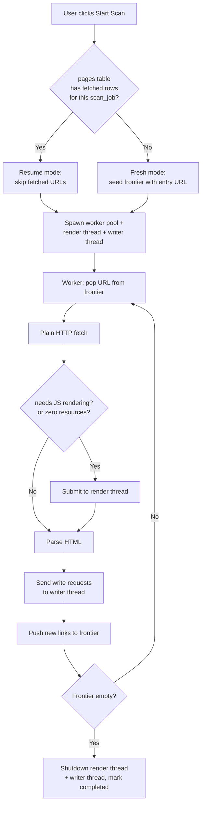

# Crawler Performance & Scaling Overhaul

## Problem Frame

Claude Crawler MVP ships with a **single-threaded BFS loop** that sleeps `rate_limit` seconds between every page, opens a new SQLite connection on every CRUD, and stubs out Playwright entirely. Concrete consequences:

- A 200-page scan at default 1 s rate limit takes **>3 min** from sleeps alone, before network latency.
- JS-rendered sites (Next.js / Nuxt / React SPA) return **zero resources** because `fetch_page(use_playwright=True)` just logs a warning and returns `None`.
- Large sites (1000+ pages) are untested; the in-memory frontier is lost on any process termination, and there is no way to partially resume work already done.
- `get_resources` runs an N+1 query for tags, and every page triggers 3–4 separate SQLite connection open/close cycles, amplifying overhead as scale grows.

This overhaul turns the crawler into something that can realistically run against real-world sites with hundreds to low-thousands of pages, handle JS-rendered content, and resume partial work — **without** moving to a distributed architecture.

## Architecture Shape

Three threads own specific resources; worker threads coordinate through queues. This pattern resolves sync-Playwright thread-affinity and SQLite single-writer constraints simultaneously.

```
  ┌──────────────────┐     render requests     ┌───────────────────┐
  │  N worker threads│ ─────────────────────▶  │ 1 render thread   │
  │  (default 8)     │ ◀─────────────────────  │ (owns Playwright) │
  │  plain HTTP      │     rendered HTML       └───────────────────┘
  │  + parse         │
  │  + link discovery│         writes          ┌───────────────────┐
  └──────────────────┘ ─────────────────────▶  │ 1 writer thread   │
                                               │ (owns SQLite conn)│
                                               └───────────────────┘
```

## Requirements

**Concurrency & Rate Limiting**
- R1. Replace the serial BFS loop with a `ThreadPoolExecutor`-based worker pool, **default 8 workers**, configurable per scan via the sidebar.
- R2. Rate limiting moves from global `time.sleep` to a **per-domain token bucket**; **default 5 req/s per domain** (friendly default for unfamiliar sites), configurable 1–20 req/s via the sidebar.
- R3. `Frontier` is made thread-safe (locking around `seen` set + queue) or replaced with stdlib thread-safe equivalents.

**Playwright Rendering**
- R5. A **dedicated render thread** owns the sync Playwright instance and a single long-lived browser; worker threads submit render requests via an in-process queue and await the response. This resolves sync-Playwright's thread-affinity constraint without requiring async rewrites.
- R6. Playwright is invoked via a tiered strategy: plain HTTP first; fall back to Playwright when `needs_js_rendering()` flags the response.
- R6a. Expand the JS-detection heuristic to reduce false negatives on non-React SPAs: also flag responses whose parse yields **zero resources from a page classified as `list` or `detail`** — this catches Vue/Svelte/Angular/Qwik sites the current markers miss. A post-parse retry path re-fetches via Playwright when this condition hits.
- R6b. Add a per-scan "Force Playwright for all pages" sidebar toggle so users can bypass detection when they know the target site needs rendering.
- R7. The render thread applies its own timeout (30 s per page, configurable) and retry limit; a render failure is recorded as `failed` on the page and the crawl continues.
- R8. Browser lifecycle: lazy-init on first render request (no browser process if scan has zero JS pages); explicit shutdown protocol on crawl completion, crawl failure, or worker-pool shutdown, with a 5 s hard timeout that escalates to process kill if the browser does not exit cleanly.

**Storage Efficiency**
- R13. Writes are serialized through a **single writer thread** that owns one SQLite connection for the duration of a crawl and processes batched write requests from worker/render threads via a queue. This removes per-CRUD connection churn and eliminates multi-writer `SQLITE_BUSY` contention by construction.
- R14. `get_resources` loads tags in a single joined query (`LEFT JOIN` + `GROUP_CONCAT` or equivalent) instead of N+1 lookups.
- R15. Bulk operations (tag upsert, resource-tag linking, page inserts) use `executemany` / batched transactions where they currently loop.

**Idempotent Re-run (simplified resume)**
- R9. Re-clicking "Start Scan" against an existing `scan_job` with the same entry URL does an idempotent re-run: already-fetched pages (status `fetched`) are skipped, and the frontier is rebuilt on-the-fly from already-discovered pending pages plus re-extracted links from fetched pages. No new schema.
- R11. Frontier dedup uses the existing `pages` table as the source of truth; URL normalization (R3's responsibility) ensures consistent matching.

**Observability & Progress Reporting**
- R4. Progress updates are coalesced and pushed at most once per worker-completion so the Streamlit queue is not flooded.
- R16. Progress display shows current page count + elapsed time; pages/sec and queue depth are out of scope (YAGNI at target durations).
- R17. Per-page failure reasons (HTTP error code, robots block, Playwright timeout, parse error) are persisted on the `pages` table and surfaced in the "Failed pages" section of the UI so failures are debuggable without digging into logs.

**Environment & Preflight**
- R18. At scan start, the app validates that the Playwright Chromium binary is installed (quick `sync_playwright().chromium.executable_path` check). On absence, it blocks the scan with a clear remediation message (`Run: playwright install chromium`) rather than surfacing failures page-by-page.

## User Flow



## Success Criteria

- A 200-page scan on a typical static site completes in **<45 s** (down from ~3 min baseline), measured against a localhost fixture at default 5 req/s rate limit + 8 workers. At 10 req/s the same scan finishes in **<25 s**.
- A 1000-page scan finishes end-to-end without OOM, within 4× the 200-page time budget at the same concurrency and rate (roughly 3 min at defaults).
- A scan against a Next.js fixture returns **non-zero** resources — current behavior returns zero.
- A scan against a Vue or Svelte SPA fixture that does not ship `__NEXT_DATA__` / `data-reactroot` markers returns **non-zero** resources via R6a's post-parse retry path.
- Killing the crawler mid-scan and clicking "Start Scan" again on the same URL does not re-fetch already-fetched pages; the run completes the remaining frontier.
- The UI "Failed pages" section shows per-page failure category and URL for every failed page, not just the aggregate count.
- When Playwright browser binary is missing, the scan is blocked at start with a clear remediation message — no silent degradation.

## Scope Boundaries

- **Out of scope**: distributed/multi-machine crawling, Redis/RabbitMQ queues, headless browser farm (Browserless, Playwright Grid).
- **Out of scope**: per-site parser adapters or a parser plugin system — separate direction.
- **Out of scope**: tag analysis depth (TF-IDF, co-occurrence, cross-job trends) — separate direction.
- **Out of scope**: migrating off SQLite. Single-writer-thread + WAL is sufficient at target scale.
- **Out of scope**: mid-fetch cancellation. If the user wants to stop a running scan, they kill the process and re-run (R9 idempotent re-run picks up where it stopped).
- **Out of scope**: auth-gated sites (cookie jars, login flows) — crawler remains anonymous.
- **Out of scope**: persisted frontier with `crawl_queue` schema — idempotent re-run (R9) delivers equivalent recovery behavior with zero schema changes.
- **Out of scope**: async Playwright / asyncio rewrite — dedicated render thread (R5) resolves thread-affinity without it.

## Key Decisions

- **ThreadPoolExecutor over asyncio, acknowledged as "preserve existing sync code"**: the win is not performance (both would hit the same network floor); it is minimizing blast radius. `requests`, `BeautifulSoup`, and the current storage layer stay sync.
- **Dedicated render thread owns Playwright**: sync Playwright is thread-affine. A render thread behind a queue gives workers a synchronous-feeling API while keeping all Playwright calls on one thread. Pairs naturally with the writer thread for a uniform "resource owner + queue" pattern.
- **Single writer thread owns the SQLite connection**: eliminates multi-writer `SQLITE_BUSY` contention by construction. Avoids `busy_timeout` tuning. One long-lived connection removes per-CRUD open/close overhead.
- **Default 5 req/s per domain**: friendly default for unfamiliar sites; fast enough that 8 workers provide real parallelism on a single domain. Users scanning their own sites can raise to 10–20 req/s.
- **Idempotent re-run over persisted frontier**: the crash-recovery window at target scale is ~1–3 minutes. A new `crawl_queue` schema + migration + resume UX costs more than re-running with "skip already-fetched" gives up. `INSERT OR IGNORE` on `pages` + `WHERE status != 'fetched'` filter on restart delivers most of the value.
- **Tiered fetch + observability-driven Playwright fallback**: plain HTTP first, Playwright when detected OR when parse yields zero resources from a page that was classified as list/detail. Catches SPAs the marker-based heuristic misses.
- **Lazy browser init, explicit shutdown timeout**: no Chromium process spawns for scans that hit zero JS pages. Shutdown has a 5 s deadline then process-kill to prevent zombie browsers.

## Dependencies / Assumptions

- Playwright browser binary must be installed (`playwright install chromium`). R18 makes this a startup check, not a silent assumption.
- Target scale is single-machine, ≤2000 pages per scan, ≤10 concurrent workers. Beyond this we would revisit the architecture.
- User-Agent and robots.txt handling stay as-is; politeness is enforced via the token bucket.

## Outstanding Questions

### Deferred to Planning
- [Affects R5][Technical] Render thread queue protocol — simple `queue.Queue` of `(url, html_hint, reply_queue)` vs. a `concurrent.futures` pattern. Planning picks the one that minimizes wrap-up on worker side.
- [Affects R13][Technical] Writer thread queue shape — one coarse op (`save_page_with_resources`) vs. fine-grained ops (`insert_page`, `insert_resource`, `link_tag`). Coarse is simpler but less flexible; planning decides based on how much logic lives in the writer.
- [Affects R6a][Needs research] Exact threshold for "suspiciously few resources triggers Playwright retry". Zero on list/detail is a clear signal; whether `<3` should also trigger needs measurement against real fixtures during planning.
- [Affects R8][Technical] Whether the 5 s shutdown timeout escalates to `browser.close(timeout=5000)` (Playwright's own cancel) or to SIGKILL on the Chromium PID. Planning decides based on Playwright's current behavior.

## Next Steps
→ `/ce:plan` for structured implementation planning
