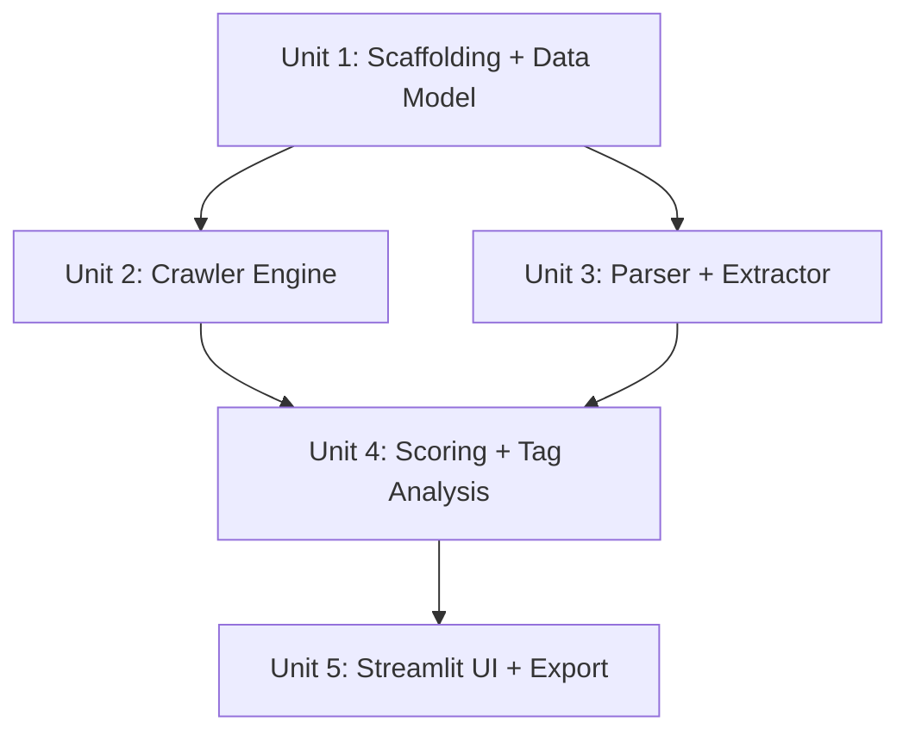

# Website Resource Scanner & Popular Tag Analyzer MVP

## Overview

构建一个本地运行的网站资源扫描工具。用户输入入口 URL 后，系统自动扫描同域页面，提取资源元数据（标题、封面、标签、互动数据），计算热门度评分，生成热门资源排行和标签分析报告。通过 Streamlit Web UI 展示结果，支持 CSV/JSON 导出。

## Problem Frame

用户需要快速了解一个网站上哪些资源最受欢迎、标签分布如何、热门标签与资源之间的关联。目前没有轻量级本地工具能一键完成"扫描 → 提取 → 评分 → 分析 → 可视化"这个流程。

## Requirements Trace

**Crawling**
- R1. 输入入口 URL，启动同域扫描（限最大 200 页、深度 3）
- R9. 速率限制、重试、日志、错误处理
- R10. 支持 JS 渲染页面（Playwright fallback）

**Data Extraction**
- R2. 抓取资源元数据：标题、URL、封面、标签、点赞/爱心/浏览量、分类、发布时间

**Analysis & Scoring**
- R3. 综合热门度评分机制
- R4. 热门资源排行榜
- R5. 全站标签分布 + 热门标签排行（按频率排序）
- R6. 标签与热门资源关系分析（每个标签对应的 top 资源）

**Presentation & Export**
- R7. Web UI 展示（Streamlit）
- R8. CSV / JSON 导出

## Scope Boundaries

- **MVP 扫描策略**：BFS 扫描列表页 + 详情页 + 标签页，不做通用搜索引擎级 crawler
- **不做**：用户系统、登录态、分布式爬虫、实时监控、多站点并行
- **不做**：NLP 语义分析、自动分类、推荐系统
- **不做**：独立 FastAPI 后端、独立 CLI（MVP 用 Streamlit 直连数据层）
- **不做**：标签共现矩阵（MVP 只需 tag→resource 映射）
- **架构注意**：写干净的模块即可，不预建 ABC/registry 等扩展抽象

## Context & Research

### Relevant Patterns

- BFS frontier 队列 + visited set 是标准爬虫模式
- SQLite WAL 模式适合单机读写并发
- Streamlit session_state 追踪扫描进度，sidebar 做控制面板
- Playwright `sync_api` 可在独立线程中使用，避免与 Streamlit event loop 冲突
- JS 渲染检测：响应含 `__NEXT_DATA__` / `data-reactroot` 或 body text < 1KB → 切 Playwright

### External References

- Playwright Python sync API: `sync_playwright`, `browser.new_page()`, `page.goto(wait_until="networkidle")`
- Streamlit: `st.dataframe`, `st.bar_chart`, `st.metric`, `st.download_button`, `st.progress`, `st.session_state`
- robots.txt: `urllib.robotparser.RobotFileParser`
- **Setup**: 首次使用需运行 `playwright install chromium` 安装浏览器二进制文件

## Key Technical Decisions

- **Streamlit-only for MVP**：不引入 FastAPI 或 CLI，Streamlit 直接调用核心库。理由：MVP 最快路径，减少一层抽象。
- **requests + Playwright 双引擎**：默认用 requests（快），检测到 JS 渲染时自动降级到 Playwright（准）。理由：大部分页面不需要浏览器，按需启动节省资源。
- **Playwright 在独立线程运行**：Streamlit 内部有 event loop，Playwright sync_api 也包装了 async loop。爬虫必须在独立 `threading.Thread` 中运行，通过 `queue.Queue` 传递进度到 UI 主线程。理由：避免 "event loop already running" RuntimeError。
- **SQLite WAL 模式**：单文件存储，WAL 模式支持读写并发（爬虫线程写，UI 线程读）。理由：本地工具无需 PostgreSQL。
- **直接函数调用，不用 ABC/Registry**：MVP 只有一个 GenericParser，用普通函数 `parse_page(html, url)` 即可。未来需要第二个 parser 时再提取接口。理由：避免预建不需要的抽象。
- **热门度评分在爬虫完成后一次性计算**：不在爬取过程中逐步算分（因 min-max 归一化依赖全局最大值）。扫描完成后读取全部资源，计算评分，批量写回。理由：避免评分随数据增长不断变化。
- **标签排行按频率排序**：MVP 不引入加权复合公式，直接 `COUNT(resources per tag) ORDER BY DESC`。理由：简单直观，用户可从 UI 同时看到频率和平均热度。
- **导出用 stdlib csv + json**：不引入 pandas 依赖。理由：200 条数据规模，csv.writer 和 json.dumps 完全够用。

## Open Questions

### Resolved During Planning

- **Q: Streamlit vs FastAPI+前端？** → Streamlit-only for MVP
- **Q: 如何检测 JS 渲染页面？** → requests 获取后检查 body text < 1KB 或含 JS 框架标记（`__NEXT_DATA__`, `data-reactroot`），符合则用 Playwright 重新获取
- **Q: 评分公式如何处理缺失字段？** → 缺失字段视为 0
- **Q: 爬虫线程如何与 Streamlit UI 通信？** → `queue.Queue` 传递进度 dict，UI 主线程轮询 queue + `st.rerun()`
- **Q: 何时计算 popularity_score？** → 爬虫完成后一次性计算（依赖全局 max 值做归一化）
- **Q: GenericParser 如何提取互动数据？** → 在同一 DOM 容器（parent element）内查找数字 + 关键词组合。容器指包含关键词文本的最近 `<li>`, `<span>`, `<div>` 祖先元素。未匹配时返回 0

### Deferred to Implementation

- **具体的 CSS selector 模式**：依赖目标站点结构，实现时确定
- **分页翻页策略**：URL 参数翻页 vs 按钮点击，实现时根据站点结构处理

## High-Level Technical Design

> *This illustrates the intended approach and is directional guidance for review, not implementation specification.*

```
┌─────────────────────────────────────────────────┐
│              Streamlit UI (app.py)               │
│  ┌──────────┐ ┌──────────┐ ┌─────────────────┐ │
│  │ Scan     │ │ Rankings │ │ Tag Analysis    │ │
│  │ Control  │ │ Table    │ │ Charts          │ │
│  └────┬─────┘ └────┬─────┘ └────┬────────────┘ │
│       │             │            │               │
│  polls queue.Queue  │ reads DB   │ reads DB      │
└───────┼─────────────┼────────────┼───────────────┘
        │             │            │
┌───────▼─────────────▼────────────▼───────────────┐
│              Core Library (Python)                │
│                                                   │
│  ┌─────────┐  ┌──────────┐  ┌──────────────────┐│
│  │ Crawler  │→│ Parser   │→│ Scorer + Analyzer ││
│  │ Engine   │  │ (generic)│  │                  ││
│  │ [Thread] │  └──────────┘  └────────┬─────────┘│
│  └────┬─────┘                         │          │
│       │                               │          │
│  ┌────▼───────────────────────────────▼─────────┐│
│  │           Storage (SQLite WAL)               ││
│  │  scan_jobs │ pages │ resources │ tags │ r_t   ││
│  └──────────────────────────────────────────────┘│
│                                                   │
│  ┌──────────────────────────────────────────────┐│
│  │           Export (csv + json stdlib)          ││
│  └──────────────────────────────────────────────┘│
└───────────────────────────────────────────────────┘

Crawler Engine (runs in threading.Thread):
  URL Frontier (BFS deque) → Fetcher (requests / Playwright sync_api)
  → Domain Filter → Depth/Count Check → Link Extractor → Frontier
  → Progress updates via queue.Queue → UI polls + st.rerun()
```

### Data Model (SQLite)

```
scan_jobs
├── id INTEGER PK
├── entry_url TEXT
├── domain TEXT
├── status TEXT (pending/running/completed/failed)
├── max_pages INTEGER DEFAULT 200
├── max_depth INTEGER DEFAULT 3
├── pages_scanned INTEGER DEFAULT 0
├── resources_found INTEGER DEFAULT 0
├── created_at TIMESTAMP
└── completed_at TIMESTAMP

pages
├── id INTEGER PK
├── scan_job_id INTEGER FK
├── url TEXT
├── page_type TEXT (list/detail/tag/other)
├── depth INTEGER
├── status TEXT (pending/fetched/parsed/failed)
├── fetched_at TIMESTAMP
└── UNIQUE(scan_job_id, url)

resources
├── id INTEGER PK
├── scan_job_id INTEGER FK
├── page_id INTEGER FK
├── title TEXT
├── url TEXT
├── cover_url TEXT
├── views INTEGER DEFAULT 0
├── likes INTEGER DEFAULT 0
├── hearts INTEGER DEFAULT 0
├── category TEXT
├── published_at TEXT
├── popularity_score REAL
├── raw_data JSON
└── UNIQUE(scan_job_id, url)

tags
├── id INTEGER PK
├── scan_job_id INTEGER FK
├── name TEXT
├── resource_count INTEGER DEFAULT 0
└── UNIQUE(scan_job_id, name)

resource_tags
├── resource_id INTEGER FK
├── tag_id INTEGER FK
└── PK(resource_id, tag_id)
```

### Popularity Scoring Formula

```
popularity_score = (
    W_views  * normalize(views)  +
    W_likes  * normalize(likes)  +
    W_hearts * normalize(hearts) +
    W_recency * recency_factor(published_at)
)

normalize(x) = x / max(x_all) * 100    # min-max within scan, 0-100
recency_factor(t) = 1 / (1 + log(1 + days_since(t)))  # 0-1, recent = higher

Default weights: views=0.4, likes=0.3, hearts=0.2, recency=0.1
Final score range: 0-100

Timing: computed ONCE after crawl completes (not incrementally)
```

### Tag Analysis

```
tag_frequency     = COUNT(resources per tag)
tag_avg_score     = AVG(popularity_score of resources per tag)
hot_tags          = ORDER BY tag_frequency DESC  (MVP: simple frequency ranking)
tag_resources     = top N resources per tag by popularity_score
```

## Implementation Units



- [ ] **Unit 1: Project Scaffolding + Data Model**

**Goal:** 建立项目结构、依赖管理、SQLite schema 和数据访问层

**Requirements:** R1 (基础设施)

**Dependencies:** None

**Files:**
- Create: `pyproject.toml`
- Create: `crawler/__init__.py`
- Create: `crawler/config.py` — 默认配置常量
- Create: `crawler/storage.py` — SQLite 连接管理 + schema 初始化 + CRUD 操作
- Create: `crawler/models.py` — dataclass 定义（ScanJob, Page, Resource, Tag）
- Create: `tests/__init__.py`
- Create: `tests/test_storage.py`

**Approach:**
- `pyproject.toml` 管理依赖：requests, beautifulsoup4, playwright, streamlit, lxml
- 纯 `sqlite3` 标准库，不引入 ORM
- WAL 模式，`PRAGMA journal_mode=WAL; PRAGMA foreign_keys=ON;`
- dataclass 作为内存模型
- storage.py 同时负责连接管理和 CRUD（用 context manager）
- config.py 存放默认值（MAX_PAGES=200, MAX_DEPTH=3, RATE_LIMIT=1.0 等）

**Patterns to follow:**
- Python dataclass for models
- Context manager for DB connections
- 直接 sqlite3 调用，不加 repository 抽象

**Test scenarios:**
- Happy path: 创建 scan_job → 插入 pages/resources/tags → 查询返回正确数据
- Happy path: resource_tags 关联正确建立，按 tag 查询 resources 返回预期结果
- Edge case: 重复 URL 插入被 UNIQUE 约束拦截，不报错（INSERT OR IGNORE）
- Edge case: 空数据库查询返回空列表，不抛异常

**Verification:**
- `pytest tests/test_storage.py` 全部通过
- SQLite 文件可正常创建、读写

---

- [ ] **Unit 2: Crawler Engine**

**Goal:** 实现 BFS 爬虫核心：URL 管理、请求发送、域名限制、速率控制、重试、日志、线程安全进度报告

**Requirements:** R1, R9, R10

**Dependencies:** Unit 1

**Files:**
- Create: `crawler/core/__init__.py`
- Create: `crawler/core/frontier.py` — URL 队列管理（BFS deque + visited set）
- Create: `crawler/core/fetcher.py` — 页面获取（requests + Playwright sync_api fallback）
- Create: `crawler/core/engine.py` — 爬虫主循环，协调 frontier + fetcher + storage + progress queue
- Create: `tests/test_crawler.py`

**Approach:**
- Frontier: `collections.deque` 存 `(url, depth)` 元组，`set` 记录已访问
- 域名限制：`urlparse(url).netloc == seed_domain`
- 速率限制：`time.sleep(config.RATE_LIMIT)` between requests
- 重试：3 次，指数退避（1s, 3s, 9s）
- JS 渲染检测：requests 获取后检查 body text < 1KB 或含 JS 框架标记 → Playwright sync_api 重新获取
- **Playwright 线程模型**：engine 运行在独立 `threading.Thread` 中，Playwright sync_api 在该线程内安全使用。Lazy init browser，扫描结束时 close
- **进度通信**：engine 接受 `queue.Queue` 参数，每处理一个页面向 queue 放入 progress dict（`{pages_done, pages_total, current_url, status}`）
- robots.txt 检查：`urllib.robotparser` 首次解析，缓存结果
- 链接提取：BeautifulSoup 提取 `<a href>`，过滤非同域、非 HTTP、锚点、静态资源（.jpg, .css, .js 等）
- 日志：Python `logging` 模块，INFO 级别记录扫描进度

**Patterns to follow:**
- BFS with deque
- `threading.Thread` + `queue.Queue` for Streamlit integration
- urllib.robotparser for robots.txt
- logging module with named loggers

**Test scenarios:**
- Happy path: Frontier 添加种子 URL → pop 返回 → 添加子链接 → 按 BFS 顺序出队
- Happy path: 域名过滤正确拦截外部链接
- Edge case: 超过 max_pages 后 frontier 不再接受新 URL
- Edge case: 超过 max_depth 后不追加子链接
- Edge case: 重复 URL 不重复入队
- Error path: fetcher 请求失败 → 重试 3 次 → 记录失败页面状态，不中断扫描
- Error path: Playwright 超时 → 降级为空内容，记录 warning
- Integration: engine 运行时 progress queue 收到正确的进度更新

**Verification:**
- Frontier 单元测试通过（域名过滤、深度限制、去重、容量限制）
- Fetcher 可成功获取一个真实网页内容
- Engine 在独立线程中运行无 event loop 冲突

---

- [ ] **Unit 3: Generic Parser**

**Goal:** 实现通用 HTML 解析器，提取资源元数据和页面类型判断

**Requirements:** R2

**Dependencies:** Unit 1

**Files:**
- Create: `crawler/parser.py` — parse_page() 函数 + 提取工具函数
- Create: `tests/test_parser.py`

**Approach:**
- `parse_page(html: str, url: str) -> ParseResult` 主函数
- ParseResult dataclass: `page_type`, `resources: list[ResourceData]`, `links: list[str]`
- ResourceData dataclass: title, url, cover_url, tags, views, likes, hearts, category, published_at
- 提取策略（按优先级尝试）：
  - 标题：`og:title` meta → `<h1>` → `<title>`
  - 封面：`og:image` meta → `` in `<article>`/`<main>`
  - 标签：`[class*="tag"]` → `[rel="tag"]` → URL 含 `/tag/` 的 `<a>`
  - 互动数据：在同一 DOM 容器内（最近 `<li>/<span>/<div>` 祖先）查找数字+关键词（like/view/heart/赞/浏览/爱心）。未匹配返回 0
  - 分类：breadcrumb 最后一级 → `<nav>` 内容 → URL path segment
  - 发布时间：`<time datetime>` → `article:published_time` meta → regex 日期模式
- 页面类型判断：
  - 标签页：URL 含 `/tag/` 或 `/tags/`
  - 列表页：含 >3 个相似结构的卡片元素
  - 详情页：含单个主要内容块 + 元数据
  - 其他：以上都不匹配
- 链接提取：BeautifulSoup 提取所有 `<a href>`，返回绝对 URL 列表

**Patterns to follow:**
- 纯函数，不用 ABC/class（MVP 只有一个 parser）
- 未来需要第二个 parser 时再提取接口

**Test scenarios:**
- Happy path: 从包含 og:title, og:image, tag links, view counts 的 HTML 提取完整 ResourceData
- Happy path: 页面类型判断正确区分列表页/详情页/标签页
- Edge case: 缺失字段（无 views、无 tags）返回默认值（0 和空列表），不报错
- Edge case: 非 UTF-8 编码页面正确处理
- Edge case: 空 HTML 返回空 ParseResult
- Edge case: 互动数据关键词存在但无数字 → 返回 0

**Verification:**
- 用 3-5 个真实 HTML 片段测试提取结果
- 各字段缺失场景不抛异常

---

- [ ] **Unit 4: Popularity Scoring + Tag Analysis**

**Goal:** 实现热门度评分公式和标签统计分析逻辑

**Requirements:** R3, R4, R5, R6

**Dependencies:** Unit 1, Unit 2, Unit 3

**Files:**
- Create: `crawler/analysis.py` — 热门度评分 + 标签统计
- Create: `tests/test_analysis.py`

**Approach:**
- Scoring（爬虫完成后一次性执行）:
  - 从 DB 读取当次扫描所有 resources
  - 计算每个维度的 max 值用于归一化
  - `normalize(x) = (x / max_x) * 100` if max > 0 else 0
  - `recency_factor(t) = 1 / (1 + log(1 + days_since(t)))` → 0~1
  - `score = 0.4*norm(views) + 0.3*norm(likes) + 0.2*norm(hearts) + 0.1*recency`
  - 评分后批量 UPDATE resources.popularity_score
- Tag Analysis:
  - `get_tag_stats(scan_job_id)` → 返回 tags 列表，按 resource_count DESC 排序
  - `get_tag_resources(tag_id, limit=10)` → 返回该标签下 top N 资源（按 popularity_score DESC）
  - `get_tag_overview(scan_job_id)` → 总标签数、总资源数、平均标签数/资源

**Patterns to follow:**
- 批量读取 + 内存计算 + 批量写回（200 资源规模不需要流式处理）
- SQL 聚合查询处理标签统计

**Test scenarios:**
- Happy path: 3 个资源 views=[100,50,0], likes=[10,20,30] → 评分符合公式预期
- Happy path: 5 个标签各关联不同数量资源 → 按频率排序正确
- Happy path: get_tag_resources 返回该标签下评分最高的资源
- Edge case: 所有资源 views=0 → normalize 返回 0，不除零
- Edge case: 资源无发布时间 → recency_factor 设为 0.5（中间值）
- Edge case: 只有 1 个资源 → score = 加权和 of 100s（归一化后该资源为 max）

**Verification:**
- 评分结果范围在 0-100
- 标签排行与手动计算一致

---

- [ ] **Unit 5: Streamlit Web UI + Export**

**Goal:** 构建完整的 Web 界面：扫描控制、结果展示、标签分析可视化、CSV/JSON 导出

**Requirements:** R4, R5, R6, R7, R8

**Dependencies:** Unit 4

**Files:**
- Create: `app.py` — Streamlit 主入口（所有 UI 逻辑在一个文件中）
- Create: `crawler/export.py` — CSV/JSON 导出函数
- Create: `tests/test_export.py`

**Approach:**
- **线程安全扫描流程**：
  1. 用户点击 "Start Scan" → 创建 `queue.Queue()` 存入 `st.session_state`
  2. 启动 `threading.Thread(target=engine.run, args=(url, config, progress_queue))`
  3. UI 用 `st.empty()` 占位符 + 轮询 queue（`while not queue.empty(): queue.get()`）
  4. 每次 poll 后 `time.sleep(0.5)` + `st.rerun()` 刷新进度
  5. 爬虫完成后触发 scoring，更新 scan_job 状态
- 页面布局：
  - Sidebar: 扫描配置（URL 输入、max_pages slider、max_depth slider、rate_limit）+ 开始按钮
  - Main: 2 个 tab（热门资源排行 | 标签分析）
- Rankings Tab:
  - `st.dataframe` 展示资源排行（标题、评分、views、likes、hearts、标签、发布时间）
  - 排序、筛选支持（Streamlit 原生）
  - 封面图预览（`st.image` in expander）
- Tag Analysis Tab:
  - `st.bar_chart` 热门标签 Top 20（按频率）
  - `st.metric` 总标签数、总资源数、平均标签数/资源
  - 选择标签 → `st.selectbox` → 显示该标签下 top 资源
- Export:
  - 每个 tab 底部 `st.download_button` 导出 CSV/JSON
  - 用 stdlib `csv.writer` 和 `json.dumps`（不依赖 pandas）

**Patterns to follow:**
- Streamlit session_state for stateful scan tracking
- `threading.Thread` + `queue.Queue` for background crawler
- 所有 UI 逻辑在单个 `app.py` 中（函数拆分，不拆文件）

**Test scenarios:**
- Happy path: 导出 3 个资源为 CSV → 文件含 header + 3 行数据，字段完整
- Happy path: 导出 JSON → valid JSON，ensure_ascii=False
- Edge case: 空结果导出 → CSV 只有 header，JSON 为空数组
- Edge case: 资源标签含逗号 → CSV 正确转义
- Integration: `streamlit run app.py` 启动无报错，扫描一个小站点后 UI 展示排行和标签

**Verification:**
- `streamlit run app.py` 启动无报错
- 扫描一个真实小站点，2 个 tab 都正确展示数据
- 下载按钮可正常导出 CSV/JSON 文件
- 连续两次扫描 → 状态正确重置

## System-Wide Impact

- **Interaction graph:** Streamlit UI → (thread) Crawler Engine → Storage ← UI reads。单向写入，UI 只读
- **Thread model:** 爬虫在独立线程运行（Playwright sync_api 安全），通过 queue.Queue 传递进度，UI 主线程轮询 queue + 读 DB
- **Error propagation:** 爬虫错误在 engine 层捕获并记录到 pages.status=failed，不中断整体扫描。UI 层展示失败页面计数
- **State lifecycle:** scan_job 状态机 pending→running→completed/failed，通过 DB 持久化，Streamlit 刷新时可恢复显示
- **External impact:** 对目标网站的请求压力。通过 rate_limit + robots.txt + max_pages 控制

## Risks & Dependencies

| Risk | Mitigation |
|------|------------|
| 目标站点结构差异大，GenericParser 提取率低 | GenericParser 覆盖常见 HTML 模式；模块化设计允许未来添加站点专用 parser |
| JS 渲染页面 Playwright 启动慢 | Lazy init browser，只在需要时启动；MVP 不追求速度 |
| 反爬机制（验证码、IP 封禁） | User-Agent 伪装 + rate limit；MVP 不处理高级反爬 |
| Streamlit + Playwright event loop 冲突 | 爬虫在独立 threading.Thread 运行，Playwright sync_api 在该线程安全使用 |
| SQLite 读写并发 | WAL 模式 + 单写入者（爬虫线程）+ 多读者（UI 线程）|

## Project Directory Structure

```
claude-crawler/
├── pyproject.toml
├── app.py                  # Streamlit 入口
├── crawler/
│   ├── __init__.py
│   ├── config.py           # 默认配置
│   ├── models.py           # dataclass 定义
│   ├── storage.py          # SQLite 连接 + CRUD
│   ├── parser.py           # 通用 HTML 解析
│   ├── analysis.py         # 评分 + 标签统计
│   ├── export.py           # CSV/JSON 导出
│   └── core/
│       ├── __init__.py
│       ├── frontier.py     # BFS URL 队列
│       ├── fetcher.py      # 页面获取
│       └── engine.py       # 爬虫主循环
├── tests/
│   ├── __init__.py
│   ├── test_storage.py
│   ├── test_crawler.py
│   ├── test_parser.py
│   ├── test_analysis.py
│   └── test_export.py
└── data/                   # SQLite DB files (gitignored)
```

## Sources & References

- Playwright Python sync API: `sync_playwright`, thread-safe when used in dedicated thread
- Streamlit API: st.dataframe, st.bar_chart, st.metric, st.download_button, st.progress, st.session_state
- Streamlit threading: background thread + queue.Queue + st.rerun() pattern
- urllib.robotparser: robots.txt parsing
- SQLite WAL mode: concurrent read/write support
