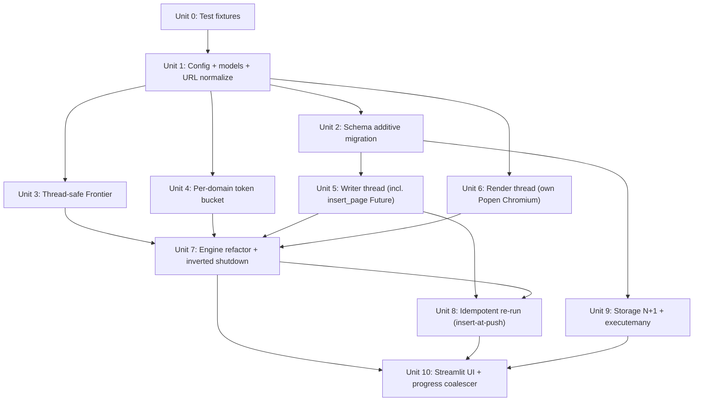

# refactor: Crawler Performance & Scaling Overhaul

## Overview

Replace the single-threaded BFS crawl loop with a three-thread-owner architecture: N worker threads driven by a `ThreadPoolExecutor`, one dedicated render thread owning Chromium (launched via our own `subprocess.Popen`), and one dedicated writer thread owning a single SQLite connection. Add a per-domain token bucket rate limiter, enable real Playwright rendering with zero-resource fallback, and support idempotent re-runs so a killed scan resumes from where it stopped.

**Target gains**: 200-page scan drops from ~3 min to **<60 s at friendly defaults** (5 req/s single-domain); <25 s at 10 req/s; JS-rendered sites start returning resources; partial work survives interruption.

## Problem Frame

See origin: `docs/brainstorms/2026-04-17-crawler-performance-scaling-requirements.md`.

The MVP ships with:
- `crawler/core/engine.py` running a serial `while` loop with `time.sleep(rate_limit)` between pages — 200 pages takes 200+ s of sleep alone.
- `crawler/core/fetcher.py` stubbing Playwright (`use_playwright=True` returns `None` with a warning) — SPA sites return zero resources silently.
- Every CRUD opening its own SQLite connection via `storage.get_connection()` — per-CRUD open/close churn amplifies at scale.
- In-memory `Frontier` — any process interruption drops all in-flight work *and* all discovered-but-unvisited URLs.
- `storage.get_resources` doing N+1 tag lookups.

## Requirements Trace

From the origin document (see origin for rationale):

- R1. ThreadPoolExecutor worker pool, default 8 workers
- R2. Per-domain token bucket, default 5 req/s (range 1–20)
- R3. Thread-safe Frontier
- R4. Coalesced progress updates (at most one event per 250 ms window)
- R5. Dedicated render thread owns sync Playwright + single browser
- R6. Tiered fetch: plain HTTP first, Playwright fallback on `needs_js_rendering()`
- R6a. Post-parse zero-resource retry on `list`/`detail` pages
- R6b. "Force Playwright" sidebar toggle
- R7. Render thread timeout (30 s) + retry + failure path
- R8. Lazy browser init + 5 s shutdown deadline → process kill
- R9. Idempotent re-run: seed frontier from `pages` table; insert at push-time so discovered URLs survive restart
- R11. Frontier dedup uses `pages` table as source of truth
- R13. Single writer thread owns one long-lived SQLite connection — **no exceptions**; `insert_page` and `update_scan_job` go through the writer via a synchronous `Future` RPC
- R14. `get_resources` loads tags via single joined query
- R15. Bulk operations use `executemany`
- R16. Progress shows pages + elapsed time
- R17. Per-page failure reason persisted + surfaced in UI
- R18. Startup Playwright binary preflight check

## Scope Boundaries

See origin "Scope Boundaries" for the full list. Key exclusions this plan honors:
- No `crawl_queue` table — `pages` table is the single source of truth; we write at push-time instead of adding a new schema
- No mid-crawl cancellation, no asyncio rewrite
- No per-site parser adapters, no tag analysis depth, no auth-gated sites
- No migration off SQLite
- No UI rewrite — Streamlit stays, progress emitter coalesces to 250 ms windows

## Context & Research

### Relevant Code and Patterns

- **Existing thread+queue pattern** at `app.py:69-86` — template for render/writer thread lifecycle.
- **Existing batch-connection pattern** at `crawler/core/engine.py:129-144` — template for writer-thread long-lived connection + PRAGMAs.
- **`storage.save_resource_with_tags(..., conn=conn)`** signature already supports external-connection mode — writer thread consumes it verbatim.
- **Stateless `parser.parse_page`** — pure function, safe to call from any worker thread.
- **Existing test DB fixture**: `tempfile.mkstemp(suffix=".db")` + `init_db` + `yield` + `os.unlink`.
- **Mocking convention**: `@patch` at import site, not source site.
- **Logging convention**: `logger = logging.getLogger(__name__)` + `%s` formatting, not f-strings.
- **Config convention**: module-level constants in `crawler/config.py`, per-scan overrides via `run_crawl(...)` function args.

### Design Patterns Applied

- **SQLite concurrent-writer lock failure**: known failure mode — `database is locked` can trigger at just 2 concurrent writers without busy_timeout or serialization. **Validates R13 with no exceptions** — routing `insert_page` outside the writer would reproduce this failure.
- **ThreadPoolExecutor inverted shutdown pattern**: `try/finally` closing (1) render thread first so in-flight worker futures resolve with exceptions, (2) worker pool next, (3) writer last. Inverted from naive order to bound shutdown time.
- **Sentinel-shutdown pattern**: `None` on queue → exit; `queue.get(timeout=0.5)` so shutdown can't hang.
- **N+1 fix pattern**: `LEFT JOIN ... GROUP_CONCAT` collapses per-row lookups into a single query. Direct template for R14.
- **Streamlit + Playwright foot-gun** (noted in this project's MVP plan): `event loop already running` RuntimeError when Playwright sync touches Streamlit main thread. Render thread isolation solves this by construction.

### External References

None consulted — local patterns and institutional knowledge cover all load-bearing decisions. One deferred-to-implementation: confirm Chromium launch arguments match Playwright's own (`--no-first-run`, `--disable-background-timer-throttling`, etc.) for parity.

## Key Technical Decisions

- **Three-thread-owners, no exceptions**: workers + 1 render thread + 1 writer thread. All SQLite writes (including `insert_page` and `update_scan_job`) flow through the writer via synchronous `Future`-backed RPC. This eliminates `SQLITE_BUSY` entirely at design time, not at tuning time.
- **Insert-at-push-time for resume correctness**: Frontier's `push(url, depth)` enqueues a `InsertPageRequest` to the writer and receives a `page_id` via `Future.result()` before pushing to the in-memory queue. On a killed scan, every discovered URL already has a `pages` row with `status='pending'`, so resume is just `SELECT url, depth, id FROM pages WHERE scan_job_id=? AND status='pending'`. Write volume increases but resume correctness is free.
- **Coarse writer-queue protocol**: each message = `(scan_job_id, page_id, ParseResult, failure_reason | None)`. Writer wraps per-page ops in explicit `BEGIN IMMEDIATE` / `COMMIT` for true transactional atomicity. Python's sqlite3 auto-begin + `isolation_level=None` is used to control transaction boundaries explicitly.
- **`concurrent.futures.Future` for render + insert_page replies**: worker submits request, gets a `Future`, calls `.result(timeout=...)`. Render uses `RENDER_TIMEOUT - 1 s` on the worker side so the render thread's `page.goto(timeout=RENDER_TIMEOUT*1000)` fires first and Future doesn't get orphaned.
- **Inverted shutdown order**: render thread first (cancels pending Futures with exceptions → workers see exceptions immediately → drain fast) → worker pool next → writer last (flushes all pending writes). Shutdown bound: <10 s total; target test case.
- **Own-Popen Chromium launch**: render thread uses `subprocess.Popen(chromium_path, [...chromium args...])` + Playwright's `connect_over_cdp` pattern (or `launch(executable_path=...)` then keep the Popen handle). PID is known and owned — `browser.close(timeout=5000)` → if Popen still alive after 5 s, `os.kill(pid, SIGKILL)`.
- **Sentinel-based shutdown**: render and writer threads stop on receiving `None`. Engine orchestrator emits sentinels as part of the inverted shutdown sequence.
- **R6a triggers on zero resources from `list`/`detail` pages only**: retry runs at most once per page; second zero-resource result is accepted.
- **Lazy browser init**: render thread launches Chromium only on first `RenderRequest`.
- **Progress coalescing: 250 ms flush window**: progress emitter thread holds most-recent-value buffer, flushes at most 4× per second. Guarantees terminal `status` values are sticky (never overwritten by subsequent "running" events).
- **New `pages.failure_reason TEXT` column**: additive migration in `init_db` via `PRAGMA table_info` inspection + conditional `ALTER TABLE`, wrapped in `BEGIN IMMEDIATE` to avoid two-process races.
- **Preflight check at scan start**: `sync_playwright().chromium.executable_path` lookup right before browser init. Blocks scan with `RuntimeError("Playwright browser not installed. Run: playwright install chromium")` if missing.

## Open Questions

### Resolved During Planning

- **insert_page path**: routed through writer thread with `InsertPageRequest → Future[page_id]`. R13 holds with zero exceptions.
- **Resume semantics**: `insert_page(status='pending')` at push/discovery time. Discovered URLs survive process death; resume filters `status='pending'`.
- **Render thread reply**: `concurrent.futures.Future` with worker-side timeout = `RENDER_TIMEOUT - 1 s` so render thread's own timeout fires first.
- **Shutdown order**: render → executor → writer. Target <10 s total.
- **Chromium PID source**: our own `subprocess.Popen(executable_path, args)` launched by render thread; Playwright attaches via `connect_over_cdp` or `launch(executable_path=...)`. PID is always known.
- **Writer-thread granularity**: coarse — one message per page, explicit `BEGIN IMMEDIATE` / `COMMIT` per message.
- **R6a detection threshold**: `page_type in {"list", "detail"} and len(resources) == 0`. Tighter thresholds deferred.
- **`scan_jobs` migration**: additive, race-safe via `BEGIN IMMEDIATE`.
- **URL normalization**: consolidated into `crawler/core/url.py:normalize(url)` + `tests/fixtures/url_corpus.txt` golden file.
- **Performance target**: <60 s @ 5 req/s (single-domain 200 pages); <25 s @ 10 req/s.

### Deferred to Implementation

- Exact Chromium launch arguments for our own Popen (parity with Playwright's defaults; confirm via `playwright codegen --help`).
- Whether `connect_over_cdp` or `launch(executable_path=...)` is the cleaner way to bind Playwright to our Popen — pick whichever reliably exposes the PID.
- Exact `executemany` batch size for tag upsert — start with per-page batch.
- Whether R6a zero-resource retry should increment a `pages.retry_count` column for observability — add only if diagnosis needs it.

## High-Level Technical Design

> *Directional guidance for review, not implementation specification.*

```
                 Engine (orchestrator thread)
                         │
       ┌─────────────────┼─────────────────┐
       │                 │                 │
       ▼                 ▼                 ▼
 ThreadPoolExecutor  RenderThread     WriterThread
 (N workers)         (owns Popen       (owns SQLite conn)
                      Chromium +
                      Playwright)
       │                 ▲                 ▲
       │                 │ RenderRequest   │ InsertPageRequest
       │                 │ + Future[html]  │ + Future[page_id]
       │                 │                 │ PageWriteRequest
       │                 │                 │ (page + resources)
       │                 │                 │
       ▼                 │                 │
 Worker loop ────────────┘                 │
   pop URL ◄──── Frontier                  │
   (Frontier.push calls writer for         │
    insert_page before pushing to queue)   │
   check robots                            │
   acquire token bucket (per-domain)       │
   plain HTTP fetch                        │
   if needs_js or R6a trigger:             │
      submit RenderRequest → await Future  │
   parse_page                              │
   submit PageWriteRequest ────────────────┘
   push new links to Frontier (which inserts them)
   emit progress (buffered, 250ms flush)

Shutdown sequence (inverted):
  1. render_thread.shutdown()      ← cancels pending Futures, closes Chromium
  2. executor.shutdown(wait=True)  ← workers see exceptions, drain fast
  3. writer.shutdown()             ← flushes all pending writes, closes conn
  4. update_scan_job (via writer, before its shutdown is the last op)
```

### Data-flow contracts (new dataclasses in `crawler/models.py`)

```
RenderRequest:
  url: str
  future: Future[str | None]       # worker awaits

InsertPageRequest:
  scan_job_id: int
  url: str
  depth: int
  future: Future[int]              # page_id returned

PageWriteRequest:
  scan_job_id: int
  page_id: int
  parse_result: ParseResult | None
  page_status: str                 # "fetched" | "failed"
  page_type: str                   # from parse_result or unchanged
  failure_reason: str | None

# Writer queue receives: InsertPageRequest | PageWriteRequest | ScanJobUpdateRequest | None (sentinel)
```

## Implementation Units



### - [ ] Unit 0: Test fixtures

**Goal:** Provide the committed test fixtures every downstream acceptance gate depends on.

**Requirements:** Support test scenarios for R1, R5, R6a, R9, R18.

**Dependencies:** None

**Files:**
- Create: `tests/fixtures/url_corpus.txt` — 20 real URLs, one per line, with expected `normalize()` output in a sibling `url_corpus_expected.txt`
- Create: `tests/fixtures/static_site/` — static HTML tree for the 200-page benchmark (200 interlinked HTML files, mix of `list` and `detail` page shapes)
- Create: `tests/fixtures/spa_nextjs/` — pre-built Next.js export (at least `__NEXT_DATA__` marker + real resource content)
- Create: `tests/fixtures/spa_vue/` — pre-built Vue export that does NOT ship `__NEXT_DATA__` / `data-reactroot` (exercises R6a zero-resource retry path)
- Create: `tests/fixtures/fixtures_README.md` — documents how to serve each fixture (`python -m http.server` at each directory)

**Approach:**
- `static_site/` can be generated by a small script `tests/fixtures/generate_static_site.py` that emits HTML into the tree — this keeps the fixture reproducible and reviewable.
- SPA fixtures: commit the pre-built output so CI doesn't need Node; document the regeneration command in `fixtures_README.md`.
- URL corpus covers: trailing-slash variants, fragments, queries, case variations, relative-to-absolute cases, IDN domains (one), root-path edge case.

**Patterns to follow:**
- Existing `tests/` layout (flat, no conftest.py).

**Test scenarios:**
- Test expectation: none — this unit creates test artifacts, not code behavior. Downstream units' tests consume these fixtures.

**Verification:** Running `python -m http.server 8000` in `tests/fixtures/static_site/` exposes 200 linked HTML pages; `curl -s http://localhost:8000/ | grep -c '<a href'` returns >= 200.

---

### - [ ] Unit 1: Config + models + URL normalize

**Goal:** Add new tunables, data contracts, and a single canonical URL normalizer.

**Requirements:** R1, R2, R7 (config), R8 (config), R17 (Page.failure_reason field), R9 (normalizer contract). R18 preflight implementation is in Unit 6.

**Dependencies:** Unit 0 (URL corpus for golden-file test)

**Files:**
- Modify: `crawler/config.py` — add `WORKER_COUNT=8`, `REQ_PER_SEC_PER_DOMAIN=5.0`, `REQ_PER_SEC_MIN=1.0`, `REQ_PER_SEC_MAX=20.0`, `RENDER_TIMEOUT=30`, `RENDER_RETRY_COUNT=2`, `BROWSER_SHUTDOWN_TIMEOUT=5.0`, `PROGRESS_FLUSH_MS=250`, `ZERO_RESOURCE_RETRY_PAGE_TYPES={"list", "detail"}`
- Modify: `crawler/models.py` — add `RenderRequest`, `InsertPageRequest`, `PageWriteRequest`, `ScanJobUpdateRequest` dataclasses
- Create: `crawler/core/url.py` — module with `normalize(url: str) -> str`
- Modify: `crawler/core/engine.py` — replace `_normalize_url` with `from crawler.core.url import normalize`
- Modify: `crawler/core/frontier.py` — replace `_normalize` with the same
- Create: `tests/test_url.py`

**Approach:**
- `url.normalize` consolidates the two existing implementations. Lowercase netloc, strip trailing slash on non-root paths, drop fragment, preserve query.
- Dataclasses describe message shapes only — no behavior.

**Patterns to follow:**
- Existing dataclass style in `crawler/models.py`.
- Module-constant style in `crawler/config.py`.

**Test scenarios:**
- Happy path: `normalize("HTTPS://Example.com/Foo/")` returns `"https://example.com/Foo"`.
- Happy path: `normalize("https://example.com/")` returns `"https://example.com/"` (root preserved).
- Edge case: `normalize("https://a.com/p?x=1#frag")` returns `"https://a.com/p?x=1"`.
- Edge case: `normalize("https://a.com")` and `normalize("https://a.com/")` return the same value (lock decision in test).
- Integration: golden-file test reads `tests/fixtures/url_corpus.txt` and `url_corpus_expected.txt`, asserts every pair matches.

**Verification:** All `tests/test_url.py` scenarios pass; existing `test_crawler.py` + `test_parser.py` stay green after import swap.

---

### - [ ] Unit 2: Schema additive migration for `pages.failure_reason`

**Goal:** Persist per-page failure reasons; make migration race-safe for the theoretical two-process case.

**Requirements:** R17

**Dependencies:** Unit 1

**Files:**
- Modify: `crawler/storage.py` — extend `SCHEMA` with `failure_reason TEXT DEFAULT ''`; extend `init_db` to run race-safe additive migration
- Modify: `crawler/models.py` — add `failure_reason: str = ""` to `Page` dataclass
- Modify: `tests/test_storage.py` — add migration tests

**Approach:**
- Fresh DBs: `CREATE TABLE` gets the column.
- Existing DBs: `BEGIN IMMEDIATE` → `PRAGMA table_info(pages)` → if column missing, `ALTER TABLE pages ADD COLUMN failure_reason TEXT DEFAULT ''` → `COMMIT`. Race loser catches `sqlite3.OperationalError: duplicate column name` and proceeds.
- `update_page(**kwargs)` dynamic SQL already accepts arbitrary columns.

**Patterns to follow:**
- Existing `init_db` idempotency style.

**Test scenarios:**
- Happy path: fresh `init_db` → `failure_reason` column exists with `DEFAULT ''`.
- Migration: create DB with pre-column schema → `init_db` adds column, existing rows get `NULL` or default.
- Idempotency: `init_db` called twice → second call is a no-op.
- Race: two threads call `init_db` on same path simultaneously → both return cleanly; column added exactly once (test via `threading.Barrier`).
- Integration: `update_page(db, page_id, failure_reason="HTTP 503")` persists and reads back.

**Verification:** All migration tests pass including the race scenario.

---

### - [ ] Unit 3: Thread-safe Frontier

**Goal:** Enable concurrent `push`/`pop` from the worker pool without lost updates.

**Requirements:** R3

**Dependencies:** Unit 1

**Files:**
- Modify: `crawler/core/frontier.py` — add `threading.Lock`; wrap `push`, `pop`, `is_done`, `visited_count`
- Modify: `tests/test_crawler.py` — add `TestFrontierThreadSafe` class

**Approach:**
- Single `self._lock = threading.Lock()` in `__init__`.
- `push` and `pop` wrap body in `with self._lock:`.
- `is_done` is a `len(self._queue) == 0` check under the lock (cheap).
- Existing API preserved.

**Note:** `Frontier.push` gets a new collaborator in Unit 8 (calls writer.insert_page). Unit 3 only adds the lock; Unit 8 adds the writer integration.

**Patterns to follow:**
- Coarse single-lock pattern (wrap public methods, no lock-free or RW splits).

**Test scenarios:**
- Happy path: single-threaded push/pop regression.
- Edge case: 8 threads push 100 unique URLs each → `visited_count` == total unique pushed.
- Edge case: 8 threads pop from a 50-item frontier → exactly 50 returned, no duplicates.
- Integration: push/pop interleaved from 4 threads for 1 s → no race, no duplicates.

**Verification:** Concurrent tests pass with `threading.Barrier` sync; sequential tests green.

---

### - [ ] Unit 4: Per-domain token bucket

**Goal:** Enforce per-domain `req/s` politeness under concurrency.

**Requirements:** R2

**Dependencies:** Unit 1

**Files:**
- Create: `crawler/core/ratelimit.py` — `TokenBucket` + `DomainRateLimiter`
- Create: `tests/test_ratelimit.py`

**Approach:**
- `TokenBucket(rate: float)`: classic refill-over-time. `acquire()` blocks until token available.
- `DomainRateLimiter(default_rate)`: lazy-creates a bucket per `urlparse(url).netloc`. Dict + `threading.Lock` guarding the dict only (individual buckets have their own locks).

**Patterns to follow:**
- Module-constant defaults from `crawler.config`.

**Test scenarios:**
- Happy path: `TokenBucket(rate=10.0)` — 10 acquires in ~1 s (±100 ms).
- Edge case: `TokenBucket(rate=5.0)` — 50 acquires from 8 threads in ~10 s total.
- Edge case: 2 domains × 4 threads each → parallelism across domains, serial within.
- Error path: `rate <= 0` raises `ValueError`.
- Integration: `DomainRateLimiter.acquire("https://a.com/x")` and `.acquire("https://b.com/y")` proceed in parallel.

**Verification:** Timing tests pass within ±100 ms tolerance.

---

### - [ ] Unit 5: Writer thread with insert_page Future

**Goal:** Serialize ALL DB writes through one long-lived connection. No exceptions to R13.

**Requirements:** R13, R15

**Dependencies:** Unit 1 (dataclasses), Unit 2 (failure_reason column)

**Files:**
- Create: `crawler/core/writer.py` — `WriterThread` class with `start()`, `insert_page(scan_job_id, url, depth) -> int` (synchronous helper wrapping Future), `write_page(PageWriteRequest)`, `update_scan_job(ScanJobUpdateRequest)`, `shutdown(timeout=5.0)`
- Modify: `crawler/storage.py` — extend `update_page`, `update_scan_job` to accept `conn=` kwarg; refactor `save_resource_with_tags` tag-link loop to `executemany`
- Create: `tests/test_writer.py`

**Approach:**
- Owns `queue.Queue[Request | None]` (bounded `maxsize=100` for backpressure) and a long-lived `sqlite3.Connection` with `isolation_level=None` (explicit transaction control) + WAL + foreign_keys + row_factory.
- `run()` loop: `get(timeout=0.5)` → per-request handler → wrap in `BEGIN IMMEDIATE` / `COMMIT`. On `None` sentinel → close connection, exit.
- `InsertPageRequest` handler: `INSERT OR IGNORE INTO pages (scan_job_id, url, depth, status) VALUES (?, ?, ?, 'pending')`. If row inserted, return `cursor.lastrowid` via `Future.set_result`. If row exists (duplicate URL), return existing `id` via `SELECT id WHERE scan_job_id=? AND url=?`. Either way Future completes.
- `PageWriteRequest` handler: `update_page(conn, page_id, status=..., page_type=..., failure_reason=..., fetched_at=NOW)` + `save_resource_with_tags(conn, ..., resource)` for each resource, inside a single `BEGIN IMMEDIATE` transaction.
- Synchronous helper `insert_page(scan_job_id, url, depth)`: creates `InsertPageRequest` with a fresh `Future`, enqueues, returns `future.result(timeout=5.0)`.
- Bounded queue provides natural backpressure — if worker submits faster than writer can drain, `queue.put()` blocks briefly.
- Exceptions in `run()` are logged, set as `self.last_exception`, and re-raised in `shutdown()`.

**Patterns to follow:**
- Sentinel-shutdown pattern (`None` on queue → exit loop).
- Existing `storage.py` PRAGMA setup.
- Existing `save_resource_with_tags(conn=...)` batch contract.

**Test scenarios:**
- Happy path: `insert_page()` from test thread → returns valid `page_id`; DB has 1 row with `status='pending'`.
- Happy path: 5 `write_page()` calls → shutdown → DB has 5 pages fetched, their resources, tags.
- Edge case: duplicate URL `insert_page` → returns existing `page_id`, no new row.
- Edge case: empty `ParseResult.resources` → page row updated, no resource inserts.
- Error path: FK violation → transaction rolls back cleanly; writer keeps running; next message succeeds.
- Transaction atomicity: write_page raises mid-resource-loop (mock exception after 3 of 10 resources) → all-or-nothing; no partial resources committed.
- Backpressure: `queue.Queue(maxsize=100)` → 200 `put` calls from worker thread → worker blocks after 100, queue never exceeds 100.
- Shutdown: `shutdown(timeout=2.0)` with 50 pending items → drains all 50 within 2 s; sentinel processed last.
- Integration: 8 threads submit 100 `write_page` each concurrently → writer processes all 800 in order of receipt; no DB lock errors.

**Verification:** All `test_writer.py` scenarios pass; existing `test_storage.py` stays green.

---

### - [ ] Unit 6: Render thread with own-Popen Chromium

**Goal:** Real Playwright rendering, with the render thread owning the Chromium PID directly via `subprocess.Popen`.

**Requirements:** R5, R6, R7, R8, R18

**Dependencies:** Unit 1

**Files:**
- Create: `crawler/core/render.py` — `RenderThread` class + `preflight() -> tuple[bool, str]` module-level function
- Modify: `crawler/core/fetcher.py` — remove stub `use_playwright=True` branch (caller replaced by render-thread submit in Unit 7)
- Create: `tests/test_render.py`

**Approach:**
- `preflight()`: imports `sync_playwright`, reads `chromium.executable_path`. Returns `(True, "")` on success or `(False, remediation_message)` on `Error: Executable doesn't exist...`.
- `RenderThread.start()`: spawns `threading.Thread(target=self._run, daemon=False)`. Does NOT start Playwright yet.
- `_run` loop:
  1. First request: lazy-launch. `self._chromium_proc = subprocess.Popen([executable_path, '--remote-debugging-port=0', '--headless=new', '--no-first-run', ...])`. Read the actual port from stderr. `self._playwright = sync_playwright().start()`. `self._browser = self._playwright.chromium.connect_over_cdp(f"http://127.0.0.1:{port}")`.
  2. For each `RenderRequest`: `context = browser.new_context()` → `page.goto(url, timeout=RENDER_TIMEOUT*1000)` → `html = page.content()` → `context.close()` → `future.set_result(html)`. On `playwright._impl._errors.Error`: retry up to `RENDER_RETRY_COUNT`, then `future.set_exception(e)`.
  3. On `None` sentinel or `shutdown()` call: iterate pending Futures, `set_exception(ShutdownError)`; `browser.close()` with 5 s timeout; `self._playwright.stop()`; `self._chromium_proc.terminate()` → `wait(timeout=5)` → if still alive, `self._chromium_proc.kill()`; exit.
- `shutdown(timeout=5.0)`: enqueue `None`, `thread.join(timeout)`.
- Browser-crash handling: render thread catches `Error("Browser has been closed")` on any request → sets exception on current Future → on next request tries to restart Chromium (via same Popen sequence) with backoff 1 s → 5 s → after 3 failed restarts, refuses all further requests with `RuntimeError("render thread disabled after repeated crashes")`.

**Patterns to follow:**
- `daemon=False` + explicit `.join()` + `try/finally` shutdown for threads that must complete their work.
- Existing logging conventions.

**Test scenarios:**
- Happy path: mock `sync_playwright` and `subprocess.Popen` → submit 3 `RenderRequest` → each Future resolves with mocked HTML.
- Lazy init: `start()` then `shutdown()` with zero submits → `Popen` never called.
- Preflight OK: `chromium.executable_path` returns valid path → `preflight()` returns `(True, "")`.
- Preflight missing: `executable_path` raises `Error: Executable doesn't exist...` → returns `(False, msg)` with msg containing "playwright install chromium".
- Error path: `page.goto` raises `TimeoutError` → retried `RENDER_RETRY_COUNT` times → final Future has exception set; render thread keeps accepting requests.
- Browser crash: mock `browser.close()` to return then subsequent `new_context` raises "Browser has been closed" → thread sets exception on current Future, restarts Chromium on next request.
- Crash loop: 3 consecutive crashes → thread refuses further requests with `RuntimeError`.
- Shutdown with in-flight request: submit 1 request, shutdown before it completes → Future gets `ShutdownError` exception; Popen terminated; thread joined.
- PID verification: after `shutdown()`, `self._chromium_proc.poll() is not None` (process exited).

**Verification:** All `test_render.py` pass with mocked Playwright/Popen. Manual smoke test against `https://example.com` available (not in CI).

---

### - [ ] Unit 7: Engine refactor — orchestrate with inverted shutdown

**Goal:** Replace serial BFS with ThreadPoolExecutor + render thread + writer thread + token bucket + 250 ms-coalesced progress. Inverted shutdown order.

**Requirements:** R1, R4, R6, R6a, R17, R18 (integration)

**Dependencies:** Units 3 (Frontier), 4 (ratelimit), 5 (writer), 6 (render)

**Files:**
- Modify: `crawler/core/engine.py` — rewrite `run_crawl` body
- Create: `crawler/core/progress.py` — `ProgressCoalescer` class with 250 ms flush thread
- Modify: `tests/test_crawler.py` — keep existing `TestEngine` green + add concurrent scenarios
- Create: `tests/test_progress.py`

**Approach:**
- `run_crawl(entry_url, db_path, max_pages=..., max_depth=..., req_per_sec=..., workers=..., force_playwright=False, resume=None, progress_queue=None)`:
  1. `preflight_ok, msg = render.preflight()`. If not `preflight_ok`: raise `RuntimeError(msg)` (Streamlit worker catches and displays).
  2. `init_db(db_path)`; `writer.start()`; `render.start()`; `progress.start()`.
  3. Resume detection (Unit 8 handles details): compute initial frontier seed from `pages` table or fresh.
  4. Build `Frontier(writer=writer, ...)` — Frontier's `push` calls `writer.insert_page(...)` synchronously to get `page_id`, then enqueues `(url, depth, page_id)` internally.
  5. Seed frontier with entry URL (fresh) or with resumed pending URLs.
  6. `with ThreadPoolExecutor(max_workers=workers) as executor:` submit workers while frontier has items.
- Worker `process_one_page(url, depth, page_id, rate_limiter, render_thread, writer, config)`:
  1. `rate_limiter.acquire(url)`.
  2. `_check_robots(url)` under a lock.
  3. `html = fetch_page(url)` plain HTTP. If `force_playwright`: skip to step 5.
  4. If `html is None`: write `PageWriteRequest(status='failed', failure_reason='http_error')`; return.
  5. If `force_playwright` or `needs_js_rendering(html)`: `html = render_thread.submit(url).result(timeout=RENDER_TIMEOUT - 1)`. On `TimeoutError`/`ShutdownError`: write failed + return.
  6. `result = parse_page(html, url)`.
  7. If `result.page_type in ZERO_RESOURCE_RETRY_PAGE_TYPES and not result.resources` (R6a): retry via render thread; re-parse. Flag ensures retry happens at most once.
  8. `writer.write_page(PageWriteRequest(... parse_result=result, status='fetched'))`.
  9. For each link in `result.links`: `frontier.push(link, depth + 1)` (which does `writer.insert_page` under the hood).
  10. Emit progress via coalescer.
- `ProgressCoalescer`: background thread with a `threading.Event` + `most_recent_value`. Any worker calling `coalescer.emit(event)` updates `most_recent_value` and sets the event. Flush thread `wait(timeout=0.25)` → if event was set, forward the most-recent value to `progress_queue`, clear event. Terminal statuses (`completed`, `failed`) are sticky — once set, the coalescer stops accepting `running` updates.
- Inverted shutdown (try/finally):
  1. `render.shutdown(timeout=5.0)` first — cancels pending render Futures, workers see exceptions quickly.
  2. `executor.shutdown(wait=True, cancel_futures=True)` — workers drain (fast, because render Futures already resolved).
  3. Drain any remaining in-flight completions.
  4. `writer.update_scan_job(ScanJobUpdateRequest(status=..., pages_scanned=..., resources_found=...))`.
  5. `writer.shutdown(timeout=5.0)` — last step.
  6. `progress.shutdown()` — flush final message, close coalescer.
- All error paths emit a terminal progress event so UI never hangs.

**Patterns to follow:**
- Existing `run_crawl` signature style.
- Existing `_send_progress` helper.

**Test scenarios:**
- Happy path regression: all 7 existing `TestEngine` tests pass unchanged.
- Happy path concurrent: 50 mocked URLs via `fetch_page` patch → all 50 written via writer; terminal `completed` event emitted.
- R6a: plain HTTP returns `list` HTML with zero resources → render submit fires; re-parsed result has resources → written.
- Force Playwright: `force_playwright=True` → render submit called for every URL; `fetch_page` never invoked (or only for the first HTTP, depending on chosen order).
- Error path: worker raises → `PageWriteRequest(status='failed', failure_reason=...)` submitted; crawl continues.
- Preflight fail: mock `preflight()` returning `(False, "install chromium")` → `run_crawl` raises `RuntimeError` with the message; scan_job marked `failed`.
- Shutdown bound: 8 workers blocked on mocked render that sleeps 30 s → `run_crawl` entered shutdown path → completes within **<10 s** (render.shutdown cancels futures; workers see exceptions).
- Progress coalescing: 100 `running` events within 100 ms → UI queue receives at most 1 event; `pages_done` is monotonic max; final `completed` is sticky.
- R6a no-infinite-loop: zero-resource list page → retry once → still zero resources → accepted; no second retry.
- `max_pages=10` in 50-URL frontier → 10 pages fetched, remaining URLs stay in `pages` table as `status='pending'` (will be picked up on resume).

**Verification:** All tests pass; manual 200-page localhost scan completes in **<60 s** at 5 req/s default.

---

### - [ ] Unit 8: Idempotent re-run via insert-at-push-time

**Goal:** Re-running a scan against the same entry URL picks up where the previous run left off, including rediscovering URLs that were pushed but never popped.

**Requirements:** R9, R11

**Dependencies:** Unit 5 (writer.insert_page), Unit 7 (engine orchestrator)

**Files:**
- Modify: `crawler/core/frontier.py` — `Frontier.__init__` takes `writer` parameter; `push(url, depth)` calls `writer.insert_page(scan_job_id, url, depth)` to get `page_id`; queue internally stores `(url, depth, page_id)`
- Modify: `crawler/core/engine.py` — resume detection at scan start
- Modify: `crawler/storage.py` — add `get_scan_job_by_entry_url(db_path, entry_url)`, `get_pending_pages(db_path, scan_job_id)` helpers
- Modify: `app.py` — on Start Scan click, no UI prompt; engine auto-resumes
- Modify: `tests/test_crawler.py` — add `TestResume` class

**Approach:**
- Resume detection: if `get_scan_job_by_entry_url(entry_url)` returns a job with `status != 'completed'` AND any `pages.status='pending'` rows exist → resume mode (reuse scan_job_id). Otherwise fresh scan (new scan_job_id).
- Fresh scan seeds frontier via `frontier.push(entry_url, 0)` which in turn inserts `pages` row with `status='pending'`, then pops it.
- Resume scan pre-populates `frontier._visited` with ALL known URLs from `pages` (fetched + pending + failed) so re-discovered links don't duplicate-push. Seeds frontier queue with `SELECT url, depth, id FROM pages WHERE scan_job_id=? AND status='pending'` — these already have page_ids, so push skips insert.
- `Frontier.push(url, depth)`:
  ```
  with self._lock:
    if url in self._visited:
      return
    self._visited.add(url)
    page_id = writer.insert_page(scan_job_id, url, depth)  # sync Future
    self._queue.append((url, depth, page_id))
  ```
  `writer.insert_page` handles INSERT OR IGNORE semantics — returns existing page_id if duplicate.
- `Frontier.pop()` returns `(url, depth, page_id)` (3-tuple instead of 2-tuple). Worker doesn't need a separate `insert_page` call.

**Patterns to follow:**
- Existing `INSERT OR IGNORE` semantics.
- `create_scan_job` / `get_scan_job` style.

**Test scenarios:**
- Happy path resume: scan 50 pages, process dies after 20 fetched + 30 pending, restart → second run fetches exactly the 30 pending; reuses `scan_job_id`.
- Edge case: scan completes → re-click Start → no new pages fetched; job stays `completed`.
- Edge case: scan has 10 fetched + 5 failed + 35 pending → resume → fetches 35 pending; leaves 5 failed alone (user can retry failed separately if they want).
- Edge case: immediate failure before any fetch → 0 fetched, 1 pending (entry URL) → resume seeds frontier with the pending entry URL.
- URL normalization regression: resume's `SELECT url` must equal what `normalize()` produces on re-discovery. Asserted by the golden-file test in Unit 1 + an integration test that seeds and re-discovers the same URL.
- Integration: two consecutive `run_crawl` calls with same entry URL → second returns same `scan_job_id`; `pages` has no duplicate rows.
- Frontier with writer: `Frontier(writer=writer).push(url, 0)` → `pages` table has row with `status='pending'` and returned page_id.

**Verification:** `TestResume` scenarios pass; manual kill-and-resume test against `tests/fixtures/static_site/` completes the full crawl.

---

### - [ ] Unit 9: Storage query optimization

**Goal:** Fix N+1 tag lookup; `executemany` for batch inserts.

**Requirements:** R14, R15

**Dependencies:** Unit 2

**Files:**
- Modify: `crawler/storage.py` — rewrite `get_resources`; refactor `save_resource_with_tags` tag-link loop
- Modify: `tests/test_storage.py` — assert query-count

**Approach:**
- `get_resources` new SQL: `SELECT r.*, GROUP_CONCAT(t.name, CHAR(31)) AS tag_names FROM resources r LEFT JOIN resource_tags rt ON rt.resource_id = r.id LEFT JOIN tags t ON t.id = rt.tag_id WHERE r.scan_job_id = ? GROUP BY r.id ORDER BY r.popularity_score DESC`. Split on `CHAR(31)` (ASCII unit separator — never appears in tags).
- Tag-link loop in `save_resource_with_tags`: collect `(resource_id, tag_id)` tuples then single `executemany(INSERT OR IGNORE INTO resource_tags ...)`.

**Patterns to follow:**
- N+1 → single JOIN + GROUP_CONCAT pattern (described in Context & Research).
- Existing `save_resource_with_tags(conn=...)` batch contract.

**Test scenarios:**
- Happy path: 10 resources × 30 tags → `get_resources` returns correctly split tag lists.
- Edge case: resource with zero tags → `tags=[]`, not `[""]` or `None`.
- Edge case: tag name containing `|` or `,` → unaffected since separator is `CHAR(31)`.
- Query count: `get_resources` runs exactly 1 query (asserted via connection wrapper).
- Integration: `save_resource_with_tags` with 10 tags fires one `executemany` for `resource_tags`.

**Verification:** Query-count test passes; existing storage tests green.

---

### - [ ] Unit 10: Streamlit UI + progress coalescer wiring

**Goal:** Expose new config, show failure reasons, surface preflight errors, consume coalesced progress.

**Requirements:** R1, R2, R6b, R16, R17, R18

**Dependencies:** Units 7, 8

**Files:**
- Modify: `app.py` — extend `render_sidebar`, `render_progress`, `render_results`

**Approach:**
- Sidebar:
  - `st.slider("Workers", 1, 16, config.WORKER_COUNT)` → `workers=`
  - `st.slider("Requests/sec per domain", 1.0, 20.0, config.REQ_PER_SEC_PER_DOMAIN, 0.5)` → `req_per_sec=`
  - `st.checkbox("Force Playwright for all pages")` → `force_playwright=`
  - Retire existing `rate_limit` slider.
- `render_progress`: show `pages_done / pages_total` + elapsed time + last `current_url`. Queue drain + last-value-wins already handled by coalescer.
- `render_results`: "Failed pages" expander showing `SELECT url, failure_reason FROM pages WHERE status='failed' AND scan_job_id=?`, grouped by `failure_reason` with counts.
- Preflight error: `start_scan` worker catches `RuntimeError` from preflight → puts `{"status": "failed", "error": str(e)}` on progress queue → `render_progress` displays prominently.

**Patterns to follow:**
- Existing `render_sidebar` style.
- Existing session_state handling.

**Test scenarios:**
- Test expectation: none for UI layout — tested manually with screenshots. Behavioral changes (worker flow, preflight propagation) covered by Unit 7.
- Manual: set workers=4 / rate=2.0 / force_playwright=on → scan → log shows these values reach engine.
- Manual: `playwright uninstall chromium` → click Start → UI shows remediation; no per-page errors.
- Manual: after scan with failures, expander shows URL + failure category counts.

**Verification:** Manual walkthrough against the static + SPA fixtures.

---

## System-Wide Impact

- **Interaction graph:** engine orchestrator spawns 3 thread types. All SQLite writes go through writer. All Playwright calls go through render thread. Frontier becomes a facade that delegates URL persistence to the writer. Streamlit worker thread is the outermost container.
- **Error propagation:** per-page errors → `PageWriteRequest(status='failed', failure_reason=...)`. Fatal errors (preflight, writer exception, render thread exhausted) raise to Streamlit worker → progress queue `{"status":"failed","error":...}`.
- **State lifecycle risks:**
  - *Partial-write*: eliminated by `BEGIN IMMEDIATE` / `COMMIT` per message in writer.
  - *Orphan browser process*: eliminated by render thread owning the Popen + SIGKILL fallback.
  - *Leaked worker thread*: `executor.shutdown(wait=True, cancel_futures=True)` + render shutdown first makes worker exit fast.
  - *Zombie frontier discovery*: eliminated by insert-at-push-time (R9).
- **API surface parity:** `run_crawl` gains `workers`, `req_per_sec`, `force_playwright`, `resume` kwargs — all with defaults.
- **Integration coverage:** Units 5, 6, 7, 8 have cross-layer scenarios (queue → DB, queue → browser, engine → both).
- **Unchanged invariants:**
  - `parse_page` pure.
  - Dataclass fields additive only.
  - `INSERT OR IGNORE` semantics preserved.
  - Streamlit's daemon-thread + queue pattern preserved.

## Risks & Dependencies

| Risk | Likelihood | Impact | Mitigation |
|------|-----------|--------|------------|
| sync Playwright thread-affinity violation | Low (by construction) | High | Render thread owns all Playwright calls; workers can't touch it directly. |
| SQLite `database is locked` | Low (by construction) | High | All writes through single writer thread; no exceptions. |
| Render shutdown can't cancel in-flight `page.goto` | Medium | Medium | Render thread does `context.close()` on shutdown which aborts navigation; worker-side timeout = `RENDER_TIMEOUT - 1 s` so render's own timeout fires first. |
| Chromium zombie on hard crash | Low | Medium | Render owns Popen PID; SIGKILL in shutdown with 5 s timeout. |
| Writer exception silently halts DB | Medium | High | Writer logs + sets `last_exception`; `shutdown()` re-raises; crawl fails explicitly. |
| Writer queue backpressure stalls workers | Medium | Low | `maxsize=100` is intentional; stall is signal the writer is slow, not a bug. Acceptable at target scale. |
| Browser crash loop | Low | Medium | 3-crash circuit breaker in render thread; scan continues without JS rendering for remaining URLs. |
| R6a double-fetch on imperfect parser | Medium | Low | R6a adds SPA-marker sanity check on raw HTML before render retry (deferred optimization — land basic R6a first, tune if false positive rate is high). |
| Existing serial-order tests fail under concurrency | High | Medium | Run `test_crawler.py` early in Unit 7; adjust tests that assert ordering (not behavior). |
| `playwright install chromium` missing on deploy | Medium | Low | R18 preflight blocks scan with clear remediation. |

## Phased Delivery

All work lands as a single logical milestone because Units 5-10 have tight interdependencies. Phasing is a PR-sizing convenience, not a separable-value claim.

**Phase 1 — Primitives (independently mergeable):** Units 0, 1, 2, 3, 4, 9. Zero user-visible change. Ship in any order.

**Phase 2 — Core architecture + integration:** Units 5, 6, 7, 8, 10. These must land together to deliver user-visible value. Sub-PRs within this phase are fine for review, but the feature only ships when all five are merged.

## Documentation Plan

- **README.md** (root): Add "Performance tuning" section (worker / rate knobs) + "Prerequisite: `playwright install chromium`" line.

(CHANGELOG and inline docstrings are covered by repo conventions — not separate deliverables.)

## Operational / Rollout Notes

- **No DB migration scripts** — idempotent `init_db`.
- **Deploy precondition**: `playwright install chromium`. R18 preflight surfaces missing installation cleanly.
- **Reversibility**: revert merge commit if needed; all storage changes additive.
- **Manual acceptance gates** before marking complete:
  1. Localhost 200-page fixture (`tests/fixtures/static_site/`): scan completes in **<60 s at 5 req/s** defaults.
  2. Next.js fixture (`tests/fixtures/spa_nextjs/`): at least 1 resource returned.
  3. Vue fixture (`tests/fixtures/spa_vue/`): resources returned via R6a retry path.
  4. Kill-mid-scan (`SIGTERM` mid-crawl) + restart: no page refetched; remaining pending URLs processed.
  5. Missing Playwright binary: preflight blocks with `"Run: playwright install chromium"` message.
  6. Shutdown stress: during active crawl with 8 render-blocked workers, initiate `SIGTERM` → process exits within 10 s; DB state consistent.

## Sources & References

- **Origin:** [docs/brainstorms/2026-04-17-crawler-performance-scaling-requirements.md](../brainstorms/2026-04-17-crawler-performance-scaling-requirements.md)
- **Related code:** `crawler/core/engine.py`, `crawler/core/fetcher.py`, `crawler/core/frontier.py`, `crawler/storage.py`, `app.py`
- **Related plans:** [2026-04-16-001-feat-website-resource-tag-analyzer-plan.md](./2026-04-16-001-feat-website-resource-tag-analyzer-plan.md), [2026-04-16-002-fix-no-resources-found-plan.md](./2026-04-16-002-fix-no-resources-found-plan.md)
