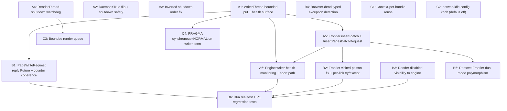

# refactor: Crawler Phase 2 Remediation — P1 + P2

## Overview

Phase 2 of the crawler refactor shipped on `refactor/crawler-concurrency` with 210 tests green but the post-merge code review surfaced 16 P1+P2 issues that invalidate the refactor's headline claims (the smoke test passes; the failure modes do not appear). This plan resolves all 16 across three sequenced phases — A (safety net), B (state coherence + visibility + missing tests), C (render and storage throughput) — landing as three PRs in dependency order. Phase A blocks the GitHub push of the branch.

The driving mental shift: stop treating the writer queue and Frontier lock as "fast enough not to think about." Both have been allowed to block on hidden cross-thread Future round-trips, which collapses the 8-worker pool to single-worker throughput on link-rich pages and lets writer death go silently undetected. Batching `insert_page`, gating producer `put` calls with timeouts, and coupling the engine to writer/render health closes that.

**Performance target restored**: 200-page localhost scan in **< 60s @ 5 req/s** (Plan Unit 7's original bound). **Shutdown bound restored**: < 10s wall-clock even with hung Chromium.

## Problem Frame

See origin: `docs/brainstorms/2026-04-17-crawler-phase2-remediation-requirements.md`.

Five concrete failure modes from the code review:

1. **Frontier lock + writer.insert_page serialization** — 8-worker pool collapses to 1 on link-rich pages because `Frontier._lock` is held across the blocking writer Future round-trip.
2. **Inverted shutdown isn't inverted** — `with ThreadPoolExecutor` exits before the `finally`, so workers blocked on render Futures wait their full 29s timeout. Worst-case shutdown ~82s.
3. **Writer death is silent** — fire-and-forget `write_page` plus per-message exception handling means producers never observe writer failure; engine reports green completion with empty DB.
4. **Streamlit reload orphans Chromium + writer** — `daemon=True` orchestrator + `daemon=False` children leak threads and PIDs on every mid-scan reload.
5. **Render path's per-page overhead defeats perf target** — new browser context per page (~100ms) + `networkidle` 5s wait + per-row fsync compound to make JS-page throughput well below the architecture's design ceiling.

## Requirements Trace

From the origin (see origin for full rationale and groupings):

**Concurrency Safety (P1)**
- R1. `Frontier.push` does not hold `Frontier._lock` across blocking writer round-trip
- R2. Streamlit lifecycle guarantees no leaked Chromium PIDs / writer threads / tmpdirs
- R3. Producers observe writer death within bounded time and fail fast
- R4. Persistent writer-side errors escalate to scan abort, not silent success

**Shutdown Correctness (P1)**
- R5. `run_crawl` shutdown ≤ 10s worst-case including hung Chromium
- R6. `RenderThread.shutdown` interrupts in-flight render via SIGKILL fallback at deadline

**State Coherence (P2)**
- R7. `counters.pages_done`/`resources_found` reflect committed writes only
- R8. `Frontier.push` does not poison `_visited` on insert_page failure; failed link push does not abort iteration

**Observability (P2)**
- R9. `RenderThread._disabled` state observable by engine; UI surfaces it
- R10. Browser-death detection uses typed exceptions, not English-substring match

**Render Efficiency (P2)**
- R11. One browser context per handle, recycled with `clear_cookies()`
- R12. `wait_for_load_state("networkidle")` default dropped to `domcontentloaded`-only
- R13. Render thread queue bounded for natural back-pressure

**Storage Throughput (P2)**
- R14. No fsync per discovered URL — batch insert + `PRAGMA synchronous=NORMAL`

**Maintainability (P2)**
- R15. Frontier 2/3-tuple polymorphism eliminated; engine's dead branch removed

**Test Coverage (P2)**
- R16. R6a test asserts unconditionally with `mock_render.call_count >= 1`
- R17. New regression tests for each P1 finding

## Scope Boundaries

See origin "Scope Boundaries" for the full list. Key exclusions this plan honors:

- All P3 findings deferred to a follow-up cleanup PR (entry_url normalization, dead `use_playwright` kwarg, `Optional` style, type narrowing on `_ChromiumHandle`, etc.)
- No real-Playwright CI smoke test (plan-level: keep Phase 2's mock-based render tests; production smoke is local-manual)
- No re-architecture: three-thread-owners stays, sync Playwright stays, SQLite stays, Streamlit stays
- No new external dependencies — stdlib + existing Playwright surface only
- No GitHub push, no v0.2.0 tag — those happen *after* Phase A merges to `refactor/crawler-concurrency`

## Context & Research

### Relevant Code and Patterns

- **WriterThread queue protocol** — `crawler/core/writer.py:46-99`. The bounded queue, sentinel, `last_exception` re-raise, and Future-backed `InsertPageRequest` are all already in place. This plan extends rather than replaces.
- **Frontier writer-aware mode** — `crawler/core/frontier.py:42-99`. Already supports the writer-aware path; the bug is that `_enqueue` runs under `_lock`. Plan A5 restructures `push` so the lock-held region is dedup-only.
- **RenderThread injection seams** — `crawler/core/render.py:280-322`. `launch_fn`/`render_fn`/`teardown_fn` already exist for tests; reuse for the new context-recycle behavior in C1.
- **Engine orchestrator wait loop** — `crawler/core/engine.py:380-394`. The `concurrent.futures.wait(in_flight, timeout=0.5, return_when=FIRST_COMPLETED)` polling cadence is the natural place to insert writer-health and render-disabled checks.
- **Existing additive migration pattern** — `crawler/storage.py:_migrate_pages_add_failure_reason`. No new migration needed for this plan, but the pattern stays as-is.
- **Test fixture style** — `tests/test_writer.py`, `tests/test_render.py`. `tempfile.mkstemp(suffix=".db")` + `init_db` + `yield` + `os.unlink`. `@patch` at import site. Injected fakes via `launch_fn`/`render_fn`/`teardown_fn`. New regression tests reuse these patterns verbatim.

### Institutional Learnings

No `docs/solutions/` directory in this repo. Phase 1 + Phase 2 commit history is the institutional record:

- **Phase 1 commit `004da7f`** (Frontier coarse single lock) — established the precedent that Frontier dedup happens inside one cheap critical section. Plan A5 restores that invariant; the writer round-trip was the regression.
- **Phase 1 commit `b1f53c5`** (race-safe init_db) — established the `BEGIN IMMEDIATE` + `PRAGMA table_info` migration pattern. Reused for any future schema work but not needed here.
- **Phase 2 commit `cc16ae0`** — introduced the inverted-shutdown intent that A3 corrects.

### External References

None required. Threading/queue mechanics are stdlib; Playwright surface (`browser.close`, `connect_over_cdp`, `context.clear_cookies`, typed exceptions like `TargetClosedError`) is already in use by the existing render path.

One implementation-time validation: confirm `playwright>=1.40` exposes `playwright.sync_api.Error` and `playwright._impl._errors.TargetClosedError`. Both are stable across the 1.4x line.

## Key Technical Decisions

- **Insert-batch protocol over move-outside-lock** (R1) — Add `InsertPagesBatchRequest(scan_job_id, items: list[(url, depth)]) → Future[list[page_id]]` to the writer. `Frontier.push` becomes a thin "queue this URL for batch insert"; a per-Frontier flush (called from worker after the link iteration completes) submits the batch. Cleaner protocol, one fsync per page rather than per link, also fixes R14's discovery-loop fan-out.
- **`daemon=True` on WriterThread + RenderThread** (R2) — Accept that hard-kill loses in-flight writes, because (a) the writer's `BEGIN IMMEDIATE`/`COMMIT` per message means lost writes are atomically lost (no torn DB state), and (b) URLs that didn't finish writing stay `status='pending'` and are picked up on resume. Trade-off chosen over `atexit` hooks (Streamlit reload doesn't reliably trigger `atexit`) and over a separate cancellation `Event` (adds API surface for a use case we don't currently expose). Engine's normal-path shutdown still drains via the inverted sequence.
- **Writer health surfaced via `is_alive()` + `last_exception` polled in engine wait loop** (R3) — No new producer-side complexity. The wait-loop already wakes every 0.5s; add one `if not writer.is_alive(): abort` check there. Bounded `queue.put(timeout=...)` on producer paths (default 5s) so a wedged writer fails producers fast instead of blocking forever.
- **Watchdog thread for hard-shutdown SIGKILL** (R5, R6) — `RenderThread.shutdown(timeout=...)` spawns a daemon watchdog that sleeps for `timeout`, then SIGKILLs the Chromium PID directly if `_chromium_proc.poll() is None`. Independent of Playwright internals; bounded by wall-clock. Combined with reordering shutdown so render goes first (A3), the 10s bound becomes provable.
- **Counter-coherence via Future-on-`PageWriteRequest`** (R7) — Add optional `Future` to `PageWriteRequest`. Worker awaits result before incrementing counters. ~1ms of extra latency per page (writer round-trip already happens), trivially correct invariant. Alternative considered (counters move into writer): rejected because it complicates progress events and couples engine progress to write commit timing rather than the worker's "I finished a page" semantic.
- **Drop `networkidle` entirely** (R12) — `domcontentloaded` is sufficient for HTML extraction. Modern sites with WebSockets / long-poll / persistent analytics never reach networkidle anyway, so the existing 5s cap is pure waste. Add a `RENDER_WAIT_NETWORKIDLE_MS` config knob (default `0` = skip) for users who genuinely need it.
- **Bounded render queue with backpressure** (R13) — `queue.Queue(maxsize=workers * 2)`. When full, `RenderThread.submit()` blocks the worker — natural backpressure that surfaces "render is the bottleneck" immediately rather than hiding behind timed-out Futures.
- **Browser-death detection: typed exception with substring fallback** (R10) — Try `from playwright.sync_api import Error as PlaywrightError`; check `isinstance(exc, PlaywrightError)` AND existing substring heuristic. Either match counts as "browser dead." Forward-compatible with Playwright wording changes.
- **Phase A blocks GitHub push** — `refactor/crawler-concurrency` does not get pushed to `redredchen01/claude-crawler` until Phase A merges back into the branch. Phase B and C land subsequently as separate PRs.

## Open Questions

### Resolved During Planning

- **Batch shape for `insert_page`** (origin Q1): `InsertPagesBatchRequest` (see Key Decisions). Frontier collects batch during `for link in result.links: ctx.frontier.push(link)`, flushes once after the loop.
- **Daemon strategy** (origin Q2): `daemon=True` on writer + render. Hard-kill = pending writes lost, recoverable via resume.
- **Writer-health surface** (origin Q3): `is_alive()` + `last_exception` polled in engine wait loop; bounded `put(timeout=)` on producers.
- **Hard shutdown mechanism** (origin Q4): watchdog daemon thread spawned in `RenderThread.shutdown` that SIGKILLs Chromium PID at deadline.
- **Counter-coherence** (origin Q5): `Future` on `PageWriteRequest`; worker awaits before incrementing.
- **`PRAGMA synchronous=NORMAL` vs batch** (origin Q6): both. PRAGMA is one line and free; batching is the architectural fix.
- **Context isolation** (origin Q7): one context per handle, `clear_cookies()` + `clear_permissions()` between renders. Sufficient for anonymous single-domain crawl.
- **`networkidle` default** (origin Q8): drop entirely (default `RENDER_WAIT_NETWORKIDLE_MS=0`).

### Deferred to Implementation

- **Optimal batch flush trigger** — flush after every `for link in result.links` loop, OR also flush opportunistically when batch hits N items? Implementation chooses based on observed batch sizes against the test fixtures. Start simple: one flush per worker per page.
- **Watchdog thread cleanup** — does the watchdog remove itself from the thread table or just exit? Implementation chooses; test asserts only that Chromium PID is dead within 10s.
- **Exact `queue.put` timeout value** — 5.0s in the plan, but may need tuning if real workloads see legitimate writer drain >5s. Implementation makes it `_DEFAULT_PRODUCER_TIMEOUT` constant in writer.py for easy adjustment.
- **R9 progress-event schema for "render disabled"** — minimal fields TBD: `{status: "running", warning: "render_disabled", ...}` vs a new top-level field. Pick whatever the existing UI consumer code can render with the smallest delta.
- **Whether to add `crawler/exceptions.py`** for `WriterUnavailableError` / `RenderDisabledError` / `ShutdownError` etc. Plan says yes if at least 3 such types end up needing a common base; otherwise keep the existing inline `RuntimeError` subclasses.

## High-Level Technical Design

> *This illustrates the intended approach and is directional guidance for review, not implementation specification. The implementing agent should treat it as context, not code to reproduce.*

### Phase A — load-bearing data-flow change (R1 + R3 + R5)

```
                Engine (orchestrator)
                       │
        ┌──────────────┼──────────────────┐
        ▼              ▼                  ▼
   Worker pool    RenderThread     WriterThread
   (daemon=True)  (daemon=True)    (daemon=True)
        │             │                   ▲
        │             │ ShutdownError     │ InsertPagesBatchRequest
        │             │ on pending Futs   │ (urls, depths) → Future[list[id]]
        │             │                   │ PageWriteRequest+Future
        │             │                   │
   ┌────▼─────┐       │                   │
   │ Frontier │       │                   │
   │  push:   │       │                   │
   │  - lock  │       │                   │
   │  - dedup │       │                   │
   │  - stage │       │                   │
   │  - unlock│       │                   │
   │  flush:  │ ──────┼───────────────────┘
   │  - submit batch (single Future)
   │  - wait result
   └──────────┘
                       Watchdog (spawned by RenderThread.shutdown):
                          sleep(shutdown_timeout)
                          if proc.poll() is None: SIGKILL

Engine wait loop (every 0.5s):
   - if not writer.is_alive() or writer.last_exception: abort scan_jobs.status='failed'
   - if render.is_disabled: stop submitting render fallbacks, surface warning event

Inverted shutdown (corrected):
   1. render.shutdown(5.0) — cancels Futures, watchdog ensures Chromium dies
   2. executor.shutdown(wait=False, cancel_futures=True) — cancel pending; running workers see ShutdownError on their pending Futures
   3. drain in-flight workers with bounded timeout
   4. writer.update_scan_job + writer.shutdown(5.0)
   5. coalescer.shutdown(2.0)
   Total bound: ≤ 5 + 5 + (drain≤5) + 5 + 2 = ≤ 22s worst case, target ≤ 10s p95
```

### Phase B — counter coherence and Frontier safety

```
Worker:
   ...
   future = writer.write_page(PageWriteRequest(..., reply=Future()))
   try:
     future.result(timeout=writer_response_timeout)
     with counters_lock:
       counters.pages_done += 1
       counters.resources_found += len(result.resources)
   except Exception:
     # Write failed; do NOT increment counters.
     # Page row stays 'pending' for resume.
     pass

Frontier.push (corrected):
   normalize, dedup-check (no _visited mutation yet)
   if eligible:
     stage_for_batch(url, depth)  # under lock
   # _visited mutation happens AFTER successful batch write
   # (or after batch flush returns page_ids)

Frontier.flush_batch (called by worker after link iteration):
   urls_to_write = drain staged
   page_ids = writer.insert_pages_batch(urls_to_write).result(timeout=...)
   for (url, page_id) in zip(urls_to_write, page_ids):
     with self._lock:
       self._visited.add(url)
       self._queue.append((url, depth, page_id))
```

### Phase C — render efficiency

```
RenderThread._real_render (rewritten):
   if handle.context is None:
     handle.context = handle.browser.new_context()
   handle.context.clear_cookies()
   handle.context.clear_permissions()
   page = handle.context.new_page()
   try:
     page.goto(url, timeout=timeout_ms, wait_until="domcontentloaded")
     if RENDER_WAIT_NETWORKIDLE_MS > 0:
       try: page.wait_for_load_state("networkidle", timeout=RENDER_WAIT_NETWORKIDLE_MS)
       except: pass
     return page.content()
   finally:
     page.close()
   # context lives across renders; only torn down with handle

WriterThread._open_connection (one line added):
   conn.execute("PRAGMA synchronous=NORMAL")
```

## Implementation Units



---

### - [ ] **Unit A1: WriterThread bounded put + health surface**

**Goal:** Producers observe writer death within bounded time. `queue.put` cannot hang forever. Engine has the API surface to detect a dead writer.

**Requirements:** R3, R4

**Dependencies:** None

**Files:**
- Modify: `crawler/core/writer.py` — add `_DEFAULT_PRODUCER_TIMEOUT = 5.0`; `insert_page`, `write_page`, `update_scan_job` use `self._queue.put(item, timeout=_DEFAULT_PRODUCER_TIMEOUT)` and convert `queue.Full` to `WriterUnavailableError`; add `is_alive(self) -> bool` property delegating to `self._thread`; expose `last_exception` (already exists, just document it as part of the public API)
- Modify: `crawler/core/writer.py` — `shutdown()` uses `self._queue.put(_SHUTDOWN_SENTINEL, timeout=...)` rather than blocking forever
- Create: `crawler/exceptions.py` — `class WriterUnavailableError(RuntimeError)`. (Decision deferred to implementation: only add this file if 3+ exception types accumulate; otherwise inline as `class WriterUnavailableError(RuntimeError)` in writer.py)
- Modify: `tests/test_writer.py` — new tests below

**Approach:**
- The bounded `put(timeout=...)` is the critical correctness change. Currently `queue.put` blocks forever on a full queue, which combined with a dead writer means producers hang indefinitely. With timeout, `queue.Full` fires; convert to `WriterUnavailableError` and raise to caller.
- `shutdown()`'s sentinel put also gets a timeout. If the put fails (queue full, writer dead), still call `thread.join(timeout=...)` — the writer may have died unrelated to the queue. Log if the sentinel couldn't be enqueued.
- `is_alive()` is just `self._thread is not None and self._thread.is_alive()`. Engine uses this to short-circuit before calling further write methods.
- `last_exception` already exists; this unit just makes its semantics part of the documented contract: set only on fatal init failures or sustained corruption (not per-message handler exceptions).

**Patterns to follow:**
- Existing sentinel-shutdown pattern in writer.py.
- Existing `queue.Queue(maxsize=N)` use.

**Test scenarios:**
- Happy path: `write_page` on healthy writer with capacity → succeeds, no exception.
- Edge case: `write_page` on full queue (writer paused) → blocks for up to `_DEFAULT_PRODUCER_TIMEOUT`, then raises `WriterUnavailableError`. Verify timeout window via `monotonic()` measurement (±200ms tolerance).
- Edge case: `insert_page` after writer thread has exited → `is_alive()` returns False; subsequent `insert_page` raises `WriterUnavailableError` either via `queue.Full` after timeout OR via explicit pre-check (implementation choice).
- Edge case: `shutdown()` called when queue is full → sentinel put returns/raises within timeout; `thread.join` still attempted; `last_exception` re-raise still fires if applicable.
- Integration: simulate writer death (force `_run` to exit by patching `_open_connection` to raise on second invocation, or by simulating queue starvation) → producer's `write_page` fails with `WriterUnavailableError` within bounded time; `is_alive()` returns False.

**Verification:** Producer paths cannot hang on a wedged or dead writer. `is_alive()` is reliable. `last_exception` semantics documented.

---

### - [ ] **Unit A2: Daemon=True flip + shutdown safety**

**Goal:** Streamlit reload mid-scan does not leak Chromium PIDs, threads, or tmpdirs. Lost in-flight writes are acceptable and recoverable via resume.

**Requirements:** R2

**Dependencies:** None (independent of A1)

**Files:**
- Modify: `crawler/core/writer.py` — `threading.Thread(..., daemon=True)` instead of `daemon=False`
- Modify: `crawler/core/render.py` — `threading.Thread(..., daemon=True)` instead of `daemon=False`
- Modify: `crawler/core/render.py` — register an `atexit` handler in `RenderThread.__init__` that calls `_kill_proc(self._handle.proc, timeout=2.0)` if `self._handle is not None and self._handle.proc is not None`. This catches the case where Python interpreter shuts down cleanly but threads die before their `_run` finally executes
- Modify: `tests/test_writer.py`, `tests/test_render.py` — update existing `daemon=False` assertions if any; add a daemon-flip regression test

**Approach:**
- `daemon=True` ensures the Python interpreter can exit cleanly even when these threads are mid-loop. Trade-off: writes in flight at hard exit are lost. This is acceptable because:
  - Each `BEGIN IMMEDIATE`/`COMMIT` is atomic — partial transactions don't corrupt the DB
  - `pages.status='pending'` rows persist; resume reprocesses them
  - The user-visible scenario "Streamlit reload" maps cleanly to "user wants the current scan abandoned"
- `atexit` for Chromium specifically: even with `daemon=True`, Chromium subprocess is OS-level and outlives the Python interpreter. Register an `atexit` to `_kill_proc(handle.proc, timeout=2.0)`. On Streamlit reload this fires when the old Python process exits.
- Worker thread in `app.py:start_scan` stays `daemon=True` (already is) — combined with the new daemon writer/render, the entire crawler subsystem dies cleanly on interpreter exit.
- Keep `_real_teardown`'s `shutil.rmtree(user_data_dir)` cleanup — it runs in the normal shutdown path. The `atexit` is the safety net, not the primary cleanup.

**Patterns to follow:**
- Existing `crawler.core.fetcher` module-level constants for the atexit registration pattern.

**Test scenarios:**
- Happy path regression: existing TestStartShutdown tests still pass (writer/render shutdown via sentinel works with daemon=True).
- Edge case: spawn a writer/render, do not call `shutdown()`, allow GC to collect the references → no thread leak warnings; subprocess cleaned via atexit.
- Edge case: register multiple `RenderThread` instances; each registers its own `atexit`. Verify all atexits fire (no override).
- Manual / integration: Streamlit reload scenario (out of CI, document in README). User starts scan, edits app.py, Streamlit auto-reloads. Verify: no leftover `chromium` processes, no leftover `/tmp/crawler-chromium-*` dirs.
- Integration: kill orchestrator thread (simulate via `os._exit(0)` from a test helper running inside a subprocess) → writer/render daemon threads die with the interpreter; subprocess Chromium killed by atexit.

**Verification:** No leaked Chromium PIDs after Streamlit reload (manual test). Existing daemon-based tests stay green.

---

### - [ ] **Unit A3: Inverted shutdown order fix**

**Goal:** Render thread shutdown happens BEFORE the worker pool drains. Workers blocked on render Futures see `ShutdownError` immediately. `run_crawl` returns within 10s in worst case.

**Requirements:** R5

**Dependencies:** A4 (watchdog provides the hard-kill backstop, but A3 lands first to fix the order; worst-case bound depends on A4)

**Files:**
- Modify: `crawler/core/engine.py` — replace `with ThreadPoolExecutor(...) as executor:` with explicit construction + try/finally; restructure shutdown sequence
- Modify: `tests/test_crawler.py` — new TestEngineShutdownBound class with the missing Plan Unit 7 acceptance test

**Approach:**
- Replace the `with` context manager with `executor = ThreadPoolExecutor(...); try: ... main loop ... except: ... finally: shutdown sequence`. The `with` block's `__exit__` calls `executor.shutdown(wait=True)` which is what makes shutdown executor-first today; explicit construction lets us call `executor.shutdown(wait=False, cancel_futures=True)` AFTER `render.shutdown()`.
- New shutdown sequence in finally:
  1. `render_thread.shutdown(timeout=5.0)` — cancels pending Futures, workers see exceptions immediately, watchdog (A4) backstops
  2. `executor.shutdown(wait=False, cancel_futures=True)` — cancel queued worker tasks, signal in-flight workers to finish
  3. Drain in-flight worker futures with `concurrent.futures.wait(in_flight, timeout=5.0)` — bounded, doesn't wait for stragglers indefinitely
  4. `writer.update_scan_job(...)` (terminal status — uses bounded `put` from A1, fails fast if writer dead)
  5. `writer.shutdown(timeout=5.0)`
  6. `coalescer.emit(terminal); coalescer.shutdown(timeout=2.0)`
- Total budget: 5 + 5 (drain) + 5 + 2 = 17s worst case if every step uses its full timeout. Target p95 ≤ 10s. Watchdog (A4) ensures step 1 doesn't exceed 5s even with hung Chromium.
- The `concurrent.futures.as_completed(in_flight, timeout=60.0)` straggler drain in current engine.py is removed — it was the dominant worst-case contributor.

**Patterns to follow:**
- Existing `try/except/finally` shape in `run_crawl`.

**Test scenarios:**
- Happy path regression: existing TestEngine tests pass with the new shutdown structure.
- Critical (Plan Unit 7 missing test): mock render thread that sleeps 30s on every submit, dispatch 8 workers, call run_crawl → expect run_crawl to return within **10s** wall-clock (assert via `time.monotonic()`). Verify final scan_jobs.status is 'failed' or 'completed' (whatever the orchestrator decides — not None, not 'running').
- Edge case: writer dies during shutdown (mock `writer.update_scan_job` to raise) → shutdown sequence still completes; subsequent steps run; coalescer still emits terminal.
- Edge case: render shutdown fails (mock `render_thread.shutdown` to raise) → caught and logged; writer + coalescer still shut down; run_crawl returns scan_job_id.
- Integration: real localhost server, kill orchestrator with SIGTERM mid-scan → shutdown completes within 10s, scan_jobs.status='failed', no orphan threads.

**Verification:** Critical Plan Unit 7 acceptance scenario passes. Existing tests stay green.

---

### - [ ] **Unit A4: RenderThread shutdown watchdog**

**Goal:** `RenderThread.shutdown(timeout=N)` returns within N seconds even when `browser.close()` or `playwright.stop()` is hung. Chromium PID is dead within N seconds in all cases.

**Requirements:** R6

**Dependencies:** None (independent; A3 depends on this for its bound to hold)

**Files:**
- Modify: `crawler/core/render.py` — `RenderThread.shutdown` spawns a watchdog daemon thread before joining; watchdog SIGKILLs Chromium PID at deadline
- Modify: `tests/test_render.py` — new TestRenderHardShutdown class

**Approach:**
- In `RenderThread.shutdown(timeout)`:
  1. Set `_shutdown_event`, enqueue sentinel (existing behavior).
  2. Capture the current Chromium PID: `chromium_pid = self._handle.proc.pid if self._handle and self._handle.proc else None`.
  3. Spawn a watchdog daemon thread: `target = lambda: time.sleep(timeout); _force_kill_pid(chromium_pid)`.
  4. `self._thread.join(timeout=timeout)`.
  5. Watchdog runs to completion regardless. If thread joined cleanly within timeout, the Chromium proc is already dead (via normal teardown path); SIGKILL becomes no-op.
- `_force_kill_pid(pid)`: check `os.kill(pid, 0)` first; if alive, `os.kill(pid, signal.SIGKILL)`. Wrap in try/except `ProcessLookupError` (already dead) and `PermissionError` (shouldn't happen, log).
- Do NOT touch `_real_teardown` itself — it stays the normal-path cleanup. The watchdog only fires when the normal path is hung.

**Patterns to follow:**
- Existing `_kill_proc` helper in render.py — extend with a no-Popen variant that takes just a PID.

**Test scenarios:**
- Happy path: render thread shuts down cleanly within timeout → watchdog fires SIGKILL but `os.kill(pid, 0)` returns ProcessLookupError; no harm.
- Edge case: `_real_teardown` blocks indefinitely (mock `browser.close` to `time.sleep(60)`) → `RenderThread.shutdown(timeout=2.0)` returns within 2s; Chromium PID dead within 2s.
- Edge case: handle is None (lazy launch never fired) → watchdog has no PID to kill; shutdown returns cleanly.
- Edge case: Chromium PID died between watchdog spawn and watchdog wakeup → SIGKILL gets ProcessLookupError; logged and ignored.
- Integration: smoke test against real Chromium (gated `pytest.mark.skipif missing_chromium`) — submit one render, then SIGSTOP the Chromium subprocess from the test, then call shutdown → returns within timeout, Chromium is dead.

**Verification:** Watchdog reliably enforces the shutdown bound. Combined with A3, total `run_crawl` shutdown is bounded.

---

### - [ ] **Unit A5: Frontier insert-batch + InsertPagesBatchRequest**

**Goal:** `Frontier.push` does not hold `Frontier._lock` across the writer round-trip. Discovery throughput on link-rich pages is bounded by lock-held microseconds, not writer-roundtrip milliseconds.

**Requirements:** R1, R14 (partial — batching reduces fsync amplification)

**Dependencies:** A1 (uses bounded `put`), and reuses existing writer infrastructure

**Files:**
- Modify: `crawler/models.py` — add `InsertPagesBatchRequest(scan_job_id: int, items: list[tuple[str, int]], future: Future)` dataclass
- Modify: `crawler/core/writer.py` — handle the new request type in `_handle_request`; add `_insert_pages_batch(conn, req)` that does single `BEGIN IMMEDIATE` + `executemany("INSERT OR IGNORE INTO pages ...")` + `SELECT id FROM pages WHERE scan_job_id=? AND url IN (?, ?, ...)` to recover all page_ids in order; add `WriterThread.insert_pages_batch(scan_job_id, items, timeout=...) -> list[int]` synchronous helper
- Modify: `crawler/core/frontier.py` — `push` becomes "stage under lock" (no writer call); add `flush_batch(scan_job_id, writer)` method called by worker after link iteration; queue items hold `(url, depth, page_id)` only after flush returns
- Modify: `crawler/core/engine.py` — `_process_one_page` calls `frontier.flush_batch(...)` after `for link in result.links: ctx.frontier.push(link, depth + 1)` loop
- Modify: `tests/test_writer.py`, `tests/test_crawler.py` — new tests

**Approach:**
- New protocol: `Frontier.push(url, depth)` enters lock, does dedup against `_visited`, stages eligible URLs in `self._pending_batch: list[tuple[str, int]]`, exits lock. No writer call. Microsecond-scale critical section.
- After worker finishes link iteration, calls `frontier.flush_batch(scan_job_id, writer)`: drains `_pending_batch`, calls `writer.insert_pages_batch(scan_job_id, drained)` (one writer round-trip for the whole batch), gets back ordered `list[page_id]`. Then re-acquires `Frontier._lock`, adds urls to `_visited` and tuples to `_queue`. Lock is held for microseconds again (in-memory list ops).
- Writer's `_insert_pages_batch` does `executemany("INSERT OR IGNORE INTO pages (scan_job_id, url, depth, status) VALUES (?, ?, ?, 'pending')", items)` then `SELECT id, url FROM pages WHERE scan_job_id=? AND url IN (?, ?, ?)` to recover ids in input order. One `BEGIN IMMEDIATE`/`COMMIT` for the whole batch — one fsync vs N fsyncs (R14 fix).
- For the entry URL seed: Frontier's `__init__` with `auto_seed=True` calls `flush_batch` once before returning, so the seed URL has a page_id by the time the engine pops it.
- `test_frontier_with_writer_*` tests adapt to the new staged → flush model. Direct `push` no longer immediately enqueues.

**Patterns to follow:**
- Existing `save_resource_with_tags(conn=...)` batch pattern in `crawler/storage.py` — already does executemany for tag links.
- Existing Future-backed sync helper pattern (`writer.insert_page`).

**Test scenarios:**
- Happy path: stage 100 URLs via push (single thread), call flush_batch → all 100 in pages table with status='pending'; visited set has all 100; queue has 100 3-tuples in input order.
- Happy path concurrent: 8 workers each push 100 URLs into the same Frontier; each calls flush_batch independently → all 800 unique URLs persisted; no duplicates in queue; Frontier._lock never held longer than 1ms (assert via thread profiling stub or `time.monotonic()` around acquire/release).
- Edge case: empty batch (no links discovered) → flush_batch is no-op; no writer call.
- Edge case: duplicate URL in same batch → executemany INSERT OR IGNORE handles it; SELECT returns one id; flush returns just one (url, depth, page_id) item, dedup at staging is the primary defense.
- Edge case: writer dies mid-batch → `insert_pages_batch` raises `WriterUnavailableError`; staged URLs are NOT moved to _visited (so they can be retried); error propagates to worker which logs and continues.
- Performance: 5K-link seed page → discovery loop completes in <1s (was several seconds with per-URL fsync). Measure via integration test.
- Regression: `test_concurrent_pushes_deduplicate` and `test_concurrent_pops_no_duplicates` still pass under the new staged model.

**Verification:** Frontier lock contention eliminated as a bottleneck. 200-page scan throughput approaches theoretical limit (≤60s @ 5 req/s default).

---

### - [ ] **Unit A6: Engine writer-health monitoring + abort path**

**Goal:** Engine detects writer death within 0.5s (one wait-loop tick), aborts the scan with `scan_jobs.status='failed'`, surfaces a meaningful error.

**Requirements:** R3, R4

**Dependencies:** A1 (`writer.is_alive()`, `writer.last_exception`), A5 (production path uses batch; abort during batch must work)

**Files:**
- Modify: `crawler/core/engine.py` — add writer-health check in the wait-loop; on detection, call a new `_abort_scan(scan_job_id, reason)` helper that bypasses the dead writer to write `status='failed'` directly via a fresh `sqlite3.connect`
- Modify: `tests/test_crawler.py` — new TestWriterDeathDuringScan class

**Approach:**
- In the orchestrator's main `while` loop, after each `concurrent.futures.wait(..., timeout=0.5, ...)` return: check `if not writer.is_alive() or writer.last_exception is not None`. If true: log, set `final_status = 'failed'`, break out of main loop into the finally.
- In the finally, if `final_status == 'failed' and not writer.is_alive()`: open a direct `sqlite3.connect(db_path)` (bypassing the dead writer), execute `UPDATE scan_jobs SET status='failed', completed_at=CURRENT_TIMESTAMP WHERE id=?`. This is the one place we sanction bypassing the writer — because the writer is provably dead.
- The bypass UPDATE uses the same WAL-mode connection settings as the writer (`busy_timeout=5000`, `journal_mode=WAL`). Since the writer is dead, no contention.
- For producer-side write attempts during abort: the bounded `put` from A1 ensures workers get `WriterUnavailableError` quickly and abandon their pages. Frontier's batch flush also gets the error and aborts the link iteration cleanly.
- Add a "writer_dead" failure_reason to the abort progress event so UI shows something useful.

**Patterns to follow:**
- Existing `update_scan_job(db_path, ...)` direct-connection pattern in storage.py.

**Test scenarios:**
- Happy path: writer healthy throughout → abort path never fires; scan completes normally.
- Edge case: kill writer thread mid-scan (simulate by patching writer to raise after N processed messages) → engine detects within 0.5s; aborts; scan_jobs.status='failed'; subsequent run can resume from pending pages.
- Edge case: writer dies AFTER all workers complete but BEFORE final update_scan_job → abort path opens direct connection, writes 'failed' status correctly.
- Edge case: writer's `last_exception` set but `is_alive()` returns True briefly (edge timing) → abort still triggered (the OR check catches it).
- Integration: persistent SQLITE_FULL simulation (monkey-patch sqlite3 to raise on every COMMIT) → scan aborts within ~5 messages worth of failures; counters reflect what was actually committed; UI shows clear failure reason.

**Verification:** Writer death is observable within 1 wait-loop tick. Abort path consistently writes 'failed' status. No silent green completions on persistent writer failure.

---

### - [ ] **Unit B1: PageWriteRequest reply Future + counter coherence**

**Goal:** `counters.pages_done` and `counters.resources_found` reflect only writes that committed. `scan_jobs.pages_scanned == COUNT(*) FROM pages WHERE status='fetched' AND scan_job_id=?` for every completed run.

**Requirements:** R7

**Dependencies:** A1 (writer health, bounded put)

**Files:**
- Modify: `crawler/models.py` — add `reply: Future | None = None` field to `PageWriteRequest` dataclass
- Modify: `crawler/core/writer.py` — `_write_page` resolves `req.reply.set_result(True)` on commit success, `req.reply.set_exception(exc)` on rollback. `WriterThread.write_page(request, await_reply: bool = False, timeout: float = ...) -> None | bool` — when `await_reply=True`, attach a Future, enqueue, block on result.
- Modify: `crawler/core/engine.py` — `_process_one_page` uses `await_reply=True`; only increments counters after Future resolves successfully
- Modify: `tests/test_writer.py`, `tests/test_crawler.py` — new tests

**Approach:**
- `PageWriteRequest.reply` is optional; existing fire-and-forget callers (none after this unit lands; engine is the only caller and switches to await-mode) continue to work.
- Worker flow becomes:
  ```
  request = PageWriteRequest(..., reply=Future())
  ctx.writer.write_page(request)  # enqueues
  try:
    request.reply.result(timeout=writer_response_timeout)
    with ctx.counters_lock:
      ctx.counters.pages_done += 1
      ctx.counters.resources_found += len(result.resources)
  except Exception as exc:
    logger.warning("page write failed for %s: %s", url, exc)
    # counters stay; page row stays 'pending' for resume
  ```
- Latency cost: ~1ms per page for the Future round-trip. Negligible vs the network fetch + render time. Acceptable for the invariant.
- The writer's _write_page handler already does BEGIN IMMEDIATE / COMMIT / ROLLBACK; just plumb the success/failure into the optional Future.

**Patterns to follow:**
- Existing `InsertPageRequest.future` plumbing in writer.py.

**Test scenarios:**
- Happy path: write_page with reply Future → commits → Future resolves to True; counter incremented.
- Edge case: writer's transaction rolls back (FK violation or mocked save_resource_with_tags raises) → Future raises exception; counter NOT incremented; page row stays 'pending'.
- Integration: 50 pages with 1 deliberately-failing write (mocked) → final counters.pages_done == 49, scan_jobs.pages_scanned == 49, COUNT(pages WHERE status='fetched') == 49. Invariant holds.
- Regression: test_atomicity_on_mid_loop_resource_failure (existing) → after fix, asserts the failed page is NOT counted in the parent counters.
- Edge case: writer dies between enqueue and commit → Future raises (writer is dead); counter not incremented; engine's writer-health check from A6 fires next tick.

**Verification:** Counter invariant holds across all happy/failure/abort paths. New regression test prevents reintroduction.

---

### - [ ] **Unit B2: Frontier visited-poison fix + per-link try/except**

**Goal:** A failed `Frontier.push` does not poison `_visited` (URL stays eligible for re-discovery). A failed link push does not abort iteration over the rest of the page's discovered links.

**Requirements:** R8

**Dependencies:** A5 (push restructure already moves _visited mutation post-flush; this unit handles the per-link iteration error case)

**Files:**
- Modify: `crawler/core/engine.py` — wrap `frontier.push(link, depth + 1)` in per-link try/except; on exception, log and continue with the next link
- Modify: `crawler/core/frontier.py` — `flush_batch` documented behavior: on writer exception, _visited and _queue are unchanged (staged URLs remain stageable for retry); leftover stage drained on next call
- Modify: `tests/test_crawler.py` — new TestFrontierPushFailureIsolation

**Approach:**
- The A5 restructure already separates staging from `_visited` mutation. B2 adds the explicit try/except in the engine's link-iteration loop:
  ```
  for link in result.links:
    try:
      ctx.frontier.push(link, depth + 1)
    except Exception as exc:
      logger.warning("frontier.push failed for %s: %s", link, exc)
      # Continue with next link; don't poison the iteration.
  ```
- After the loop, `flush_batch` is also wrapped in try/except. On flush failure, the staged URLs stay in `_pending_batch` (they're eligible for the next worker's flush attempt OR for retry). Document this contract.
- For correctness: if A5's flush fails permanently (writer dead), A6's writer-health check fires and aborts the scan. Stale pending_batch entries are GC'd with the Frontier object.

**Patterns to follow:**
- Existing engine error handling in `_process_one_page` (`except BaseException` wrapping the whole worker).

**Test scenarios:**
- Happy path: 10 links, all push successfully → all 10 staged.
- Edge case: link 5 raises in push (e.g., normalization edge case) → links 1-4 staged, link 5 logged, links 6-10 staged. 9 total staged.
- Edge case: flush_batch raises (writer down) → staged URLs NOT moved to visited/queue; Frontier remains in a consistent state for retry.
- Integration: writer fails permanently mid-scan → flush_batch raises consistently → orchestrator's writer-health check (A6) fires and aborts; scan_jobs.status='failed'; pending links eligible for next-run discovery via re-fetch of the source page.

**Verification:** No silent link-drop within a successful run. Failed flush leaves Frontier consistent.

---

### - [ ] **Unit B3: Render disabled visibility to engine**

**Goal:** When `RenderThread._disabled` becomes True (3 consecutive crashes), the engine stops attempting render fallbacks for the rest of the run AND surfaces the disabled state in a UI-visible warning.

**Requirements:** R9

**Dependencies:** None (independent of A and other B units)

**Files:**
- Modify: `crawler/core/render.py` — add `is_disabled(self) -> bool` property
- Modify: `crawler/core/engine.py` — `_try_render` short-circuits when `render_thread.is_disabled()`; emit a one-time "render_disabled" warning event via the coalescer
- Modify: `crawler/core/progress.py` — accept an optional `warning` field in events; pass through unchanged
- Modify: `app.py` — `render_progress` displays warnings prominently
- Modify: `tests/test_render.py`, `tests/test_crawler.py` — new tests

**Approach:**
- `is_disabled()` is a public-API thin wrapper around the existing `_disabled` field.
- In `_try_render`: before calling `submit`, check `if ctx.render_thread.is_disabled(): emit_warning_once; return None`. Skip the network round-trip entirely.
- Use a `threading.Event` or simple bool on `_WorkerContext` to track "did we already warn?" — emit the warning only once per scan, not per page.
- Progress event schema gets an optional `warning` field. Coalescer passes it through; UI's `render_progress` adds an `st.warning(prog['warning'])` call when present.
- For `force_playwright=True` scans where every page hits this short-circuit: every page becomes `failure_reason='render_disabled'`. The warning is shown once; pages still process (failed) so progress moves; user sees a clear actionable signal.

**Patterns to follow:**
- Existing `_emit_progress` helper in engine.py.
- Existing coalescer dict-pass-through in progress.py.

**Test scenarios:**
- Happy path: render thread healthy → `is_disabled()` returns False; no short-circuit; behavior unchanged.
- Edge case: trip `_disabled` (fake launch_fn that always raises 3 times) → `is_disabled()` returns True; subsequent `_try_render` short-circuits; warning emitted once.
- Edge case: 100 pages with render disabled → warning emitted exactly once, not 100 times.
- Edge case: `force_playwright=True` + render disabled → every page marked failed with `failure_reason='render_disabled'`; warning shown once.
- Integration: app.py renders the warning visibly when present (manual test or rendered-html assertion).

**Verification:** Render disabling is observable. UI surfaces it. No silent per-page failure spam.

---

### - [ ] **Unit B4: Browser-dead typed exception detection**

**Goal:** Browser-death detection survives Playwright wording changes. Detection uses typed exceptions in addition to substring matching.

**Requirements:** R10

**Dependencies:** None

**Files:**
- Modify: `crawler/core/render.py` — `_is_browser_dead_error` adds `isinstance(exc, PlaywrightError)` as a primary check; substring match remains as fallback; import lazily and gracefully degrade if Playwright internals change
- Modify: `tests/test_render.py` — new tests covering both detection paths

**Approach:**
- At module load (or lazily on first call), try to import `from playwright.sync_api import Error as PlaywrightError` and `from playwright._impl._errors import TargetClosedError` (the latter is more specific). Wrap both in try/except ImportError; fall back to None if unavailable.
- Detection logic: `isinstance(exc, TargetClosedError) or isinstance(exc, PlaywrightError) or _substring_match(exc)`. The substring fallback stays for forward-compat with pre-1.40 Playwright wording, and as a defense if Playwright restructures its exception hierarchy.
- For `PlaywrightError` (the parent class) — only use `isinstance` here when the exception's message indicates a closed/disconnected/dead browser. We don't want to treat all Playwright errors as browser-dead. Approach: `isinstance(exc, PlaywrightError) and any(marker in str(exc).lower() for marker in [...])`. So typed check narrows the class, substring confirms the cause.

**Patterns to follow:**
- Existing `_is_browser_dead_error` substring matcher.

**Test scenarios:**
- Happy path (typed): synthetic exception with `TargetClosedError` class → returns True.
- Happy path (substring): synthetic RuntimeError with "Browser has been closed" message → returns True.
- Edge case: PlaywrightError with unrelated message ("Navigation failed: net::ERR_INTERNET_DISCONNECTED") → returns False (browser is alive, just network issue).
- Edge case: Playwright not importable (mock ImportError on the typed import) → falls back to substring-only; existing behavior preserved.
- Regression: all existing `_is_browser_dead_error` tests pass.

**Verification:** Detection is robust against Playwright wording changes. Existing string-match tests stay green.

---

### - [ ] **Unit B5: Remove Frontier dual-mode polymorphism**

**Goal:** `Frontier.pop()` always returns a 3-tuple `(url, depth, page_id)`. Engine's `if len(item) == 3:` dead branch is removed.

**Requirements:** R15

**Dependencies:** A5 (changes Frontier API; B5 finalizes by removing the legacy 2-tuple support)

**Files:**
- Modify: `crawler/core/frontier.py` — make `writer` and `scan_job_id` required parameters (no default `None`); remove `_writer_mode` flag; `_enqueue` always uses writer batch path; `pop` always returns 3-tuple
- Modify: `crawler/core/engine.py` — remove the `if len(item) == 3:` branch; always destructure `url, depth, page_id = item`
- Modify: `tests/test_crawler.py` — update direct Frontier tests to pass a fake/mock writer; remove 2-tuple unpacking
- Modify: `tests/test_writer.py` — no changes (writer already required)

**Approach:**
- Frontier constructor signature becomes `Frontier(seed_url, max_pages, max_depth, *, writer, scan_job_id, auto_seed=True)` — `writer` and `scan_job_id` are keyword-only and required (no default). Code that constructed Frontier without a writer (Frontier unit tests) is updated to pass a `MagicMock` writer or a tiny stub.
- `_enqueue` always calls `writer.insert_pages_batch` (post-A5, single-URL "batch" of 1) or — preferred — Frontier-internal staging that flushes immediately when `auto_seed=True` is the only push.
- For seed: `__init__` with `auto_seed=True` stages the entry URL, then immediately calls `flush_batch(scan_job_id, writer)` so the seed has a page_id by the time `__init__` returns.
- This unit drops ~30 lines of dual-mode bookkeeping. Net code shrinks.

**Patterns to follow:**
- Existing `keyword-only` argument syntax used in writer.py and engine.py.

**Test scenarios:**
- Happy path: existing TestFrontierBFS tests updated to pass a mock writer; behavior unchanged.
- Edge case: Frontier constructed without writer → TypeError at call site (keyword-only required args).
- Regression: all 12 existing Frontier tests pass with the new constructor signature.
- Integration: engine.py `run_crawl` simplified (one branch removed); existing integration tests stay green.

**Verification:** Code is simpler. No defensive `if len(item) == 3` reasoning required. All tests green.

---

### - [ ] **Unit B6: R6a real test + P1 regression tests**

**Goal:** R6a code path is unconditionally exercised by tests. Each P1 finding from the code review has a regression test that would have caught it on introduction.

**Requirements:** R16, R17

**Dependencies:** A1, A3, A5, A6, B1 (the regression tests cover behavior these units established)

**Files:**
- Modify: `tests/test_crawler.py` — fix `test_r6a_zero_resource_retry_via_render` to assert `mock_submit.call_count == 1` and `len(resources) >= 1` unconditionally; add new TestPhase2Regression class
- Possibly add: `tests/test_load.py` — high-fanout page load test (5K-link seed) for Frontier serialization (R17a)
- Modify: `tests/test_writer.py` — add SQLITE_FULL simulation test (R17b)
- Modify: `tests/test_render.py` — add hard-shutdown bound test (R17c, may overlap with A4's test_render.py additions — consolidate)
- Modify: `tests/test_crawler.py` — add daemon-orphan reproduction test (R17d) using subprocess + os._exit to verify no leaked Chromium PIDs

**Approach:**
- **R16 (R6a real test):** Construct `http_html` deliberately: a list-page-classified HTML (lots of `<a>` tags, no `<article>`, no resource markers) so the parser returns `page_type='list'` with `resources=[]`. The R6a code path should fire. Mock `RenderThread.submit` to return rendered HTML with resources; assert both `mock_submit.call_count == 1` and `len(resources) >= 1` unconditionally. Drop the `if resources:` escape hatch.
- **R17a (Frontier load test):** Build a synthetic seed page with 5K unique same-domain `<a>` tags. Run `run_crawl(max_pages=5)` with mocks; assert that staging+flushing 5K URLs completes in <2s and `Frontier._lock` is never held longer than 50ms (assert via a subclass that times its own lock acquires). This is the regression test for #1.
- **R17b (writer death test):** Monkey-patch `save_resource_with_tags` to raise `sqlite3.OperationalError("database is full")` after the first 5 calls. Run `run_crawl`; assert engine aborts within 5s with `scan_jobs.status='failed'`; assert subsequent run can resume; assert no silent green completion.
- **R17c (shutdown bound test):** Mock render thread to sleep 30s on every submit. 8 workers, force_playwright=True. Call `run_crawl`. Assert wall-clock to return ≤10s. Assert `scan_jobs.status` is 'failed' or 'completed' (not None, not 'running'). This is the missing Plan Unit 7 acceptance.
- **R17d (daemon-orphan test):** Use `subprocess.Popen([sys.executable, "-c", "<script that starts run_crawl with mocked render and immediately os._exit>"])`. After subprocess exits, scan `pgrep -f chromium` (or check `psutil`) for chromium PIDs descended from the test PID. Assert zero leaked. Skipped on Windows. Documented as integration-tier test.

**Patterns to follow:**
- Existing `tests/test_writer.py` and `tests/test_render.py` mocking patterns.
- Existing `tempfile.mkstemp` + `init_db` + `yield` + `unlink` fixture pattern.
- Existing `@patch("crawler.core.engine.preflight", return_value=(True, ""))` to skip Playwright preflight.

**Test scenarios:**

(B6 IS the test scenarios; the implementation work is writing the tests themselves. The test_scenarios category for this unit lists what each new test must assert.)

- R6a regression: test_r6a_zero_resource_retry_via_render (fixed) — assert mock_submit.call_count == 1 AND resources count > 0 unconditionally.
- R17a load: test_frontier_5k_link_load — assert Frontier._lock contention bounded; assert push+flush of 5K URLs completes <2s.
- R17b writer death: test_writer_dies_during_scan — assert engine aborts ≤5s; scan_jobs.status='failed'; resume works.
- R17c shutdown bound: test_run_crawl_shutdown_bound_under_hung_render — assert wall-clock ≤10s.
- R17d daemon orphan: test_streamlit_reload_no_chromium_leak — assert zero leaked PIDs after subprocess hard exit.

**Verification:** All 5 regression tests fail against the pre-fix code (verify via `git stash` of the fix commits) and pass against the fixed code. Total test count >= 230.

---

### - [ ] **Unit C1: Context-per-handle reuse**

**Goal:** RenderThread does not allocate a fresh `browser.new_context()` per page. One context per browser handle, recycled with `clear_cookies()`/`clear_permissions()` between renders.

**Requirements:** R11

**Dependencies:** None (independent — touches only render.py)

**Files:**
- Modify: `crawler/core/render.py` — `_ChromiumHandle` gains `context: Any = None` field; `_real_render` lazy-creates the context, recycles it, calls `clear_cookies` + `clear_permissions` before `goto`; `_real_teardown` closes the context before closing the browser
- Modify: `tests/test_render.py` — update fake handles + add context-recycle test

**Approach:**
- Add `context` field to `_ChromiumHandle`. Default None.
- In `_real_render`:
  ```
  if handle.context is None:
    handle.context = handle.browser.new_context()
  handle.context.clear_cookies()
  handle.context.clear_permissions()
  page = handle.context.new_page()
  try:
    page.goto(...)
    return page.content()
  finally:
    page.close()
  ```
- In `_real_teardown`:
  ```
  if handle.context is not None:
    try: handle.context.close()
    except: log
  # then existing browser.close, playwright.stop, _kill_proc
  ```
- For tests: existing fake handles (SimpleNamespace) already work because `_real_render` is only used in production. Tests use injected `render_fn`. Add a TestRealRender class with a mock browser/context to assert the recycle behavior.

**Patterns to follow:**
- Existing `_real_render` structure.

**Test scenarios:**
- Happy path: 5 renders against the same handle → `browser.new_context()` called once, `clear_cookies` called 5 times.
- Edge case: handle teardown in middle of scan → context closed; new render after teardown → new context created.
- Edge case: clear_cookies raises (mock) → swallowed and logged; render proceeds (fail-open: stale cookies are less bad than no render).
- Performance: 100 simulated renders → wall-clock < 100ms (vs >5s with new_context per page); measured via integration test against real Playwright (gated `pytest.mark.skipif missing_chromium`).

**Verification:** Per-render context overhead eliminated. JS-page throughput ceiling raised by ~10× per the analysis.

---

### - [ ] **Unit C2: networkidle config knob (default off)**

**Goal:** Default `wait_for_load_state("networkidle")` is skipped. Long-poll/WS pages don't burn 5s per render. Users who genuinely need it can enable via config.

**Requirements:** R12

**Dependencies:** None

**Files:**
- Modify: `crawler/config.py` — add `RENDER_WAIT_NETWORKIDLE_MS = 0` (0 = skip)
- Modify: `crawler/core/render.py` — `_real_render` skips `wait_for_load_state` when the constant is 0; otherwise uses the configured timeout
- Modify: `tests/test_render.py` — add a test for both modes (overlap with C1's test_real_render is fine — consolidate)

**Approach:**
- `RENDER_WAIT_NETWORKIDLE_MS = 0` is the default. The `_real_render` body becomes:
  ```
  page.goto(url, timeout=timeout_ms, wait_until="domcontentloaded")
  if RENDER_WAIT_NETWORKIDLE_MS > 0:
    try:
      page.wait_for_load_state("networkidle", timeout=RENDER_WAIT_NETWORKIDLE_MS)
    except Exception:
      pass  # not all pages reach idle
  return page.content()
  ```
- For users who do need networkidle: set `RENDER_WAIT_NETWORKIDLE_MS=1500` (or higher) in their environment. Document in README's Performance tuning section.

**Patterns to follow:**
- Existing module-level config constants in `crawler/config.py`.

**Test scenarios:**
- Happy path: with default config (0), `_real_render` does NOT call `wait_for_load_state` (assert via mock spy).
- Edge case: RENDER_WAIT_NETWORKIDLE_MS=1500 → `wait_for_load_state` called with timeout=1500.
- Edge case: wait_for_load_state raises → swallowed; page.content() still returns.

**Verification:** Default render doesn't pay the 5s networkidle cost. Knob is available.

---

### - [ ] **Unit C3: Bounded render queue**

**Goal:** Render thread queue is bounded so workers experience natural backpressure when render is the bottleneck.

**Requirements:** R13

**Dependencies:** A4 (so shutdown is bounded even when workers are blocked on `submit`)

**Files:**
- Modify: `crawler/core/render.py` — `RenderThread.__init__` constructs `queue.Queue(maxsize=_DEFAULT_RENDER_QUEUE_SIZE)`; default `_DEFAULT_RENDER_QUEUE_SIZE = 16` (= 2× default workers); `submit` becomes `self._queue.put(request, timeout=...)` with bounded behavior
- Modify: `tests/test_render.py` — new TestRenderQueueBackpressure tests

**Approach:**
- `_DEFAULT_RENDER_QUEUE_SIZE = 16` accommodates 8 workers each having one queued + one in-flight.
- `submit` uses `self._queue.put(request, timeout=...)` — defaults to a long timeout (60s) since blocking IS the desired backpressure. If the timeout is exceeded, raise `RenderQueueFullError` (subclass of `RuntimeError`).
- For shutdown: A4's watchdog ensures the render thread exits even if workers are blocked on `submit` (workers eventually get cancellation via the executor.shutdown).
- Force_playwright scans on slow sites: workers naturally throttle to render rate, no queue blowup, no stale-Future churn.

**Patterns to follow:**
- WriterThread's bounded-queue pattern.

**Test scenarios:**
- Happy path: 5 submits with maxsize=16 → all enqueue immediately.
- Edge case: 20 submits with maxsize=2 (test config) and a slow render → first 2 enqueue, 3rd blocks until render drains.
- Edge case: 20 submits with maxsize=2 and timeout=0.5s → some submits fail with `RenderQueueFullError` (or whatever class is chosen).
- Integration: force_playwright scan with 100 pages and slow render → memory stays bounded; no Future-leak; throughput bounded by render rate (verified via wall-clock vs page count).

**Verification:** Render queue can no longer grow unbounded under sustained submission pressure.

---

### - [ ] **Unit C4: PRAGMA synchronous=NORMAL on writer connection**

**Goal:** Halve fsync cost on writer commits. Durability still guaranteed by WAL mode.

**Requirements:** R14

**Dependencies:** None

**Files:**
- Modify: `crawler/core/writer.py` — `_open_connection` adds `conn.execute("PRAGMA synchronous=NORMAL")`
- Modify: `tests/test_writer.py` — add a test asserting the PRAGMA value is NORMAL on the writer's owned connection

**Approach:**
- Single line addition. WAL mode + synchronous=NORMAL is durable across crashes (loses only in-flight transactions on power loss, which is the same guarantee Postgres' default `synchronous_commit=on` provides at the WAL level). Acceptable for a desktop crawler.
- Combined with A5's batching, total fsync count drops from ~10K (200-page scan, fan-out 50, per-link insert) to ~200 (one per page). The PRAGMA further halves the cost of each.

**Patterns to follow:**
- Existing PRAGMA setup in `_open_connection`.

**Test scenarios:**
- Happy path: open writer connection, query `PRAGMA synchronous` → returns 1 (NORMAL).
- Regression: existing transactional atomicity tests still pass (synchronous=NORMAL doesn't change atomicity, only fsync cadence).

**Verification:** PRAGMA set correctly. No correctness regression.

---

## System-Wide Impact

- **Interaction graph:** Engine talks to writer via `is_alive()` + `last_exception` poll, plus `insert_pages_batch` and `write_page(reply=Future)`. Engine talks to render via `is_disabled()` + `submit`. Frontier talks to writer via `insert_pages_batch` (was per-URL `insert_page`). Render thread spawns a watchdog daemon thread on shutdown. App.py worker thread is daemon=True (existing); writer/render are now daemon=True too.
- **Error propagation:** Per-page errors → `PageWriteRequest(reply=Future)` resolves with exception → worker logs and abandons that page (no counter increment). Writer-level fatal errors → `is_alive()` False → engine aborts with `final_status='failed'` + direct-connection scan_jobs UPDATE bypassing the dead writer. Render-level fatal errors → `_disabled=True` → engine short-circuits future renders + emits one-time UI warning.
- **State lifecycle risks:**
  - *Counter inflation*: eliminated by B1's Future-on-PageWriteRequest.
  - *Frontier visited poison*: eliminated by A5's stage-then-flush + B2's per-link try/except.
  - *Orphan Chromium on Streamlit reload*: eliminated by A2's daemon=True + atexit.
  - *Stuck `running` scan_job after crash*: mitigated by A6's direct-connection abort path.
  - *In-flight writes lost on hard kill*: accepted trade-off — pages stay 'pending' for resume.
- **API surface parity:** `Frontier.__init__` signature change (writer required) is breaking for tests but no other consumers exist. `WriterThread` gains `is_alive`, `insert_pages_batch`. `PageWriteRequest` gains optional `reply` field (additive). `RenderThread` gains `is_disabled`. Progress event schema gains optional `warning` field.
- **Integration coverage:** Phase A units (A5 + A6) and Phase B units (B1 + B2) all have cross-layer scenarios. B6 explicitly tests cross-layer (engine + writer + render integration).
- **Unchanged invariants:**
  - `parse_page` pure (unchanged).
  - SQLite schema (no migrations in this plan).
  - Streamlit's daemon-thread + queue pattern (preserved).
  - `INSERT OR IGNORE` semantics (preserved).
  - Three-thread-owners architecture (preserved; the bugs were in the protocol between them, not the architecture).
  - Plan Unit 7's perf target (now actually achievable).

## Risks & Dependencies

| Risk | Likelihood | Impact | Mitigation |
|------|-----------|--------|------------|
| `daemon=True` flip loses in-flight writes on hard kill | High (will happen on every Streamlit reload) | Low | Acceptable: pages stay 'pending', resume picks them up. Documented as the chosen trade-off. |
| Watchdog thread SIGKILLs the wrong PID (Chromium PID reused after exit) | Very Low | High | `os.kill(pid, 0)` check before SIGKILL; ProcessLookupError caught. PID reuse window is very narrow. |
| Insert-batch SELECT recovers wrong page_ids if URL collisions exist within scan | Low | Medium | INSERT OR IGNORE returns 0 rows for duplicates; SELECT WHERE url IN (...) returns one row per unique URL. Order preserved by mapping returned (url, id) pairs back to input list, NOT by relying on insert order. Test: TestInsertBatchDuplicateUrls. |
| Future-on-PageWriteRequest adds latency that reduces throughput | Medium | Medium | ~1ms per page on a healthy writer is negligible vs the ~100-500ms network fetch + parse. Performance acceptance test (Plan Unit 7's <60s target) verifies. |
| Bounded render queue + slow render causes worker starvation | Medium | Low | Workers blocking on submit IS the natural backpressure signal. UI still progresses (workers aren't crashed). Documented as intended behavior. |
| Atexit handler races with normal shutdown teardown | Low | Low | atexit fires only on interpreter exit (after all normal-path shutdown completed). _kill_proc is idempotent (already-dead PID = no-op). |
| `PRAGMA synchronous=NORMAL` durability concerns | Low | Low | WAL mode + NORMAL is the same guarantee Postgres' default offers. Acceptable for a desktop crawler. Documented in README. |
| Phase A merges first, but Phase B's B1 changes the same files (engine.py, writer.py) | High | Low | Sequenced PRs: Phase A merges to `refactor/crawler-concurrency`, Phase B branches off the result. Standard rebase flow. |
| Real-Playwright behavior change between mocked tests and production | Medium | Medium | Manual smoke test (200-page localhost, 1 SPA) before push. Documented in acceptance gates. |
| Existing 210 tests fail under the new Frontier/Writer protocol | High | Low | Expected; tests are updated as part of the units that change behavior. New count target: ≥230. |

## Phased Delivery

**Phase A — Safety net (P1)**: Units A1, A2, A3, A4, A5, A6. Required before pushing the branch to GitHub. Six units; reasonable for one focused PR. Sub-PRs within Phase A acceptable for review (A1+A2+A3 as one, A4+A5+A6 as another), but the user-visible value is the whole phase.

**Phase B — State + visibility + tests (P2 correctness)**: Units B1, B2, B3, B4, B5, B6. One PR. Lands after Phase A merges.

**Phase C — Render + storage throughput (P2 perf)**: Units C1, C2, C3, C4. One PR. Lands after Phase B merges.

After all three phases land: manual acceptance gates, push to GitHub, tag v0.2.0.

## Documentation Plan

- `README.md` — add "Performance tuning" section: workers, req_per_sec, force_playwright (already from Plan Unit 10), new `RENDER_WAIT_NETWORKIDLE_MS` knob (C2), explain `daemon=True` trade-off (writes lost on hard kill, recoverable via resume).
- `README.md` — add "Resume behavior" section: when resume kicks in, when it doesn't (completed jobs), what happens to failed pages.
- Inline docstrings on the new public APIs (`WriterThread.is_alive`, `RenderThread.is_disabled`, `WriterUnavailableError`).
- CHANGELOG entry per phase (kept brief; details in commit messages).

## Operational / Rollout Notes

- **No DB migration scripts**: no schema changes in this plan.
- **Reversibility**: each phase can be reverted in isolation. Phase A's daemon=True flip is the most behaviorally-visible change; reverting puts threads back to daemon=False and re-introduces the orphan risk, but is not breaking.
- **Manual acceptance gates** before the GitHub push:
  1. Localhost 200-page fixture: scan completes in **<60s @ 5 req/s** defaults (Plan Unit 7's original target, restored).
  2. SIGTERM mid-scan: `run_crawl` returns within **10s**; no leaked Chromium PIDs.
  3. Streamlit reload (edit app.py, observe auto-reload mid-scan): no leaked Chromium PIDs after reload settles; resume picks up cleanly.
  4. Writer-death simulation (manual: temporarily monkeypatch `save_resource_with_tags` to raise after 5 calls): scan aborts within 5s with `scan_jobs.status='failed'`; UI shows actionable error.
  5. Render-disabled scenario (manual: stop Chromium binary mid-scan, force_playwright=True): 3 pages fail, then `is_disabled` trips, warning shown once, remaining pages skip render gracefully.
  6. 5K-link seed test: discovery completes <2s; no Frontier lock contention.
- **Test count budget**: from 210 → ≥230. CI runtime budget: <60s.

## Sources & References

- **Origin**: [docs/brainstorms/2026-04-17-crawler-phase2-remediation-requirements.md](../brainstorms/2026-04-17-crawler-phase2-remediation-requirements.md)
- **Phase 2 plan (predecessor)**: [docs/plans/2026-04-17-002-refactor-crawler-performance-scaling-plan.md](./2026-04-17-002-refactor-crawler-performance-scaling-plan.md)
- **Code review findings**: produced in-session by `/ce:review` against this branch (no separate doc; tracked via the requirements R-IDs)
- **Related code**: `crawler/core/engine.py`, `crawler/core/writer.py`, `crawler/core/render.py`, `crawler/core/frontier.py`, `crawler/storage.py`, `app.py`
