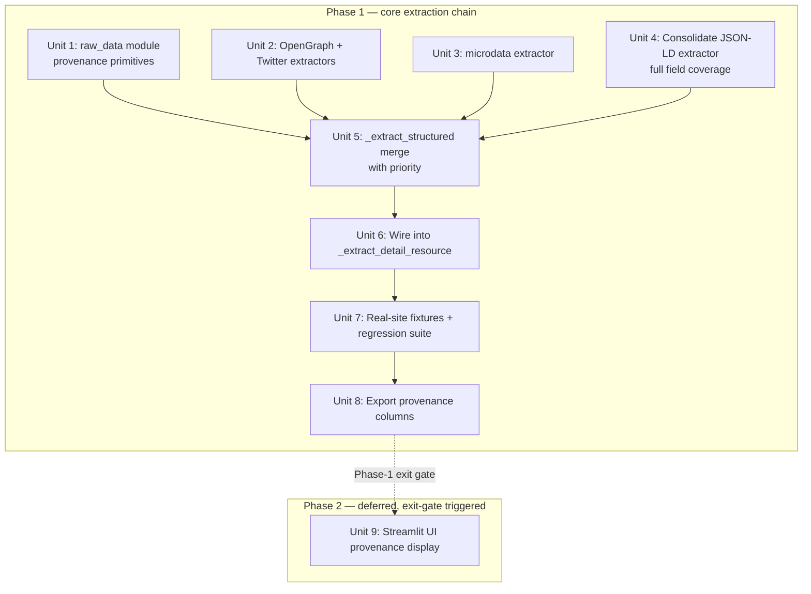

# refactor: Structured-Data-First Extraction Chain for Cross-Site Parser

## Overview

升级 `crawler/parser.py` 的抽取策略为**结构化数据优先、DOM 启发式兜底**的两段式链路。现有 parser 的每一个字段（title、cover、views/likes/hearts、tags、category、published_at）都由 DOM 启发式主导；本次改动让 `JSON-LD → OpenGraph → Twitter Cards → microdata` 成为一等公民，DOM 只在结构化路径静默时才兜底。同步建立**字段来源可观测性**：每条 resource 记录每字段来自哪一源，写入现有 `raw_data` JSON 列，并在 CSV/JSON 导出与 Streamlit UI 上暴露。

## Problem Frame

Kissavs 实地 session 证明（see origin: `docs/brainstorms/2026-04-17-structured-data-first-extraction-requirements.md`）：做 SEO 的内容站（绝大多数有规模的内容站）都内嵌 JSON-LD schema.org / OpenGraph / Twitter Cards，这些是为机器设计的规范输出。当前 parser 几乎只利用到 `og:title` / `og:image` 两个 meta —— 其余全部字段在走 DOM 扫字符串的老路。这导致：

- 字段值靠关键词邻近 heuristic，脆弱且跨站不泛化（`<span class="mr-3">14143</span>` 类无 label 的页面直接 0）
- 每个新站都要手打补丁（session 38 已经补了 6+ 处，`ce:work` 还在继续）
- 没有"为什么这个字段是这个值"的可观测性 —— debug 全靠猜

Structured-first 能一次性把 90%+ SEO 站点的抽取质量抬上一档，且新加字段只要加一条 JSON-LD 映射即可。

## Requirements Trace

**架构**
- R1. 两段式抽取链：结构化数据源（JSON-LD > OG > Twitter > microdata）命中的字段直接采信；未命中才下降到 DOM 启发式
- R2. 不改 `Resource` dataclass、不新增 storage 列、不做 migration（延续 brainstorm R2 + 本次 Q2 拍板）
- R3. 结构化抽取集中在 `crawler/parser.py` 内部 helper（不新建模块）

**数据源**
- R4. 源优先级：JSON-LD > OpenGraph > Twitter Cards > microdata > DOM
- R5. JSON-LD 支持 `@graph` 展开、`@type` 字符串或数组、InteractionCounter 完整枚举
- R6. 不做 RDFa；不做站点内联 JS 对象（`window._detail_` / `__NEXT_DATA__`）

**字段覆盖**
- R7. 结构化路径覆盖的字段（每个独立 provenance key）：`title`、`cover_url`、`views`、`likes`、`hearts`、`tags`、`category`、`published_at`。`description` 走 raw_data 备用但**不写入 Resource**（Q2 决定），不占 provenance map 的 key（它与 provenance 是 raw_data 里的 sibling 字段）
- R8. 同字段多源冲突按 R4 优先级采信第一个有效值（非空、类型正确、长度合理）

**Page-type 检测**
- R9. JSON-LD 单条目 @type + 非 root URL → detail（kissavs fix 已落地，保留不动）
- R10. `section[class*="video|article|post|detail|content"]` 主容器回退（kissavs fix 已落地，保留不动）

**观测性**
- R11. 每次提取记录每字段来源（JSON-LD / OG / Twitter / microdata / DOM / missing），写入 `Resource.raw_data` 的 JSON 里，**对外暴露到 CSV/JSON 导出和 Streamlit UI**（Q1 决定）

**兼容**
- R12. 现有测试（493）全部继续通过
- R13. ≥3 组结构化 fixture：OG-only、JSON-LD Article、JSON-LD VideoObject 全套（复用 kissavs 本地 HTML）

## Success Criteria

**Phase 1 Exit Gate — 必须全部通过才能 close Phase 1 + 考虑是否启动 Phase 2：**

1. **无字段质量回归**（adversarial F1 / F4 / F8 共识）：
   - 下载 **≥ 5 个** held-out 真实站点的 detail 页 HTML 到 `tmp/structured_holdout/`（**非** kissavs —— 新站点）
   - 实现阶段加一个 `tests/test_holdout_diff.py`：对每个 held-out fixture 并排跑 pre-refactor 版本（使用 git worktree + 历史 commit）和 Phase 1 末版本，产出字段对照 CSV：每字段 `(old_value, new_value, agree?, provenance)`
   - Gate：**每字段的 fill-rate（非空率）不下降**，且不同字段的 disagree 率 ≤ 20%（disagree 是预期的，因为结构化数据更准；降级字段是禁区）
2. **Problem Frame 的 90%+ 主张可量化**：5 站点里 ≥ 4 个站点在 views/likes/title/cover_url 至少有 1 个字段的 provenance 从 `dom` 变成结构化源
3. **既有 493 测试全部通过**（R12）
4. **新增 ≥ 15 fixture/regression 测试全部通过**（R13 + Unit 7）
5. **session 38 的那 6+ 个 per-site patch 不再需要**（scope-guardian F6）：implementation 开始前扫一遍 git log 里"feat/fix(parser)"提交，挑 3 个代表性的 site-patch，在 holdout fixture 里还原原始 HTML（或构造最小 repro），确认新链路无需专门补丁即可抽取正确值

**Phase 2 Trigger Gate（Unit 9 是否启动）：**

6. Phase 1 shipped 后**运行 ≥ 1 周 / ≥ 3 次真实 scan**
7. 工具作者在实际使用中 **至少 2 次** 反映"CSV 导出不够用，需要在 UI 里看 provenance"
8. 若 trigger 满足，Unit 9 开始前必须补 design-lens 提的 IA 合同（user job、编码、legend、空态）

**成功时 Phase 2 可永不启动** —— 这是刻意设计的 off-ramp，避免 gold-plating。

## Scope Boundaries

- **不引入** per-domain profile 注册表（YAML 按站点覆盖 selector）
- **不做** RDFa / Microformats 解析
- **不抓** 需要 JS 渲染才出现的结构化数据（RenderThread 另一层面的事）
- **不解析** 站点内联 JS 对象（`window._detail_` / `__NEXT_DATA__` / `__NUXT__`）
- **不改** `Resource` dataclass 字段（`description` 不加）
- **不改** SQLite schema、不写 migration、不动 storage 序列化逻辑
- **不拆分** `parser.py` 模块（暂留内聚）
- **不重写** 既有 DOM 启发式 —— 只让它降级为 fallback，行为保持

## Context & Research

### Relevant Code and Patterns

- `crawler/parser.py` (1214 行) —— 本次唯一实质改动的源文件。已有零件：
  - `_parse_jsonld_blocks` (第 ~200 行) —— JSON-LD 解析 + `@graph` 展开
  - `_jsonld_has_detail_entity` —— 用于 page_type 检测
  - `_extract_jsonld_metrics` —— InteractionCounter → views/likes/hearts
  - `_extract_meta` —— og/meta name 读取
  - `_extract_detail_resource` —— detail page 主入口，新链路在此接入
- `crawler/models.py:47` —— `Resource.raw_data: str = ""  # JSON string`（已是 JSON 字符串字段，无 schema 变更即可写入结构化 provenance）
- `crawler/storage.py:57` —— `raw_data TEXT NOT NULL DEFAULT '{}'`（已经写入，读出路径已有）
- `crawler/export.py` (62 行) —— `RESOURCE_FIELDS` 列表 + `export_resources_csv/json`。扩展点明确
- `app.py:485` `render_rankings` —— Streamlit dataframe 展示列表，添加 source 列或 expander 在此注入
- `tests/test_parser.py` (900+ 行) —— 既有 fixture 命名约定：`TestKissavsStyleStructuredSite`、`TestListPageDetectionGeneralization`。保持风格

### Institutional Learnings

- **`feedback_ce_review_catches_inline_misses`**（session 38 feedback memory）：新增 2+ parser/extractor helper 必须走 `ce:review mode:autofix`；inline self-review 漏过 "keyword-anchor-discarded" 类 bug
- **Session 38 out-of-scope 残项**：标题 SEO chain、breadcrumb 末项歧义、list-card title precedence —— 已在随后的 commits（294bcae / 1292c8b / d826894）修掉，无需再在本 plan 里处理

### External References

未启动外部 research —— schema.org、OpenGraph、Twitter Card 是十多年的稳定规范，本地已有 JSON-LD 解析证明可行，BS4 API 熟练度足够。

## Key Technical Decisions

| 决策 | 理由 |
|---|---|
| **串行两段式而非并行合并** | 并行两路再冲突消解 → 复杂度爆炸；串行语义可预测（结构化 miss 就 DOM），测试矩阵平坦 |
| **OG + JSON-LD + Twitter + microdata 一次做全** | 只做 JSON-LD 覆盖不全，小站往往只有 OG；四源成本边际递减（都是 meta/script scan），全做一次性收益最大 |
| **`description` 走 raw_data，不加 dataclass 字段**（Q2） | 避免 migration；未来真需要时做"干净加字段 + migration"而非先污染 Resource 再改 |
| **字段来源元信息对外暴露到 UI + export**（Q1） | 数据质量可追溯 —— 抓错值时能立刻看是哪一源骗了我，而不是猜 |
| **raw_data 格式保持内部可变**（不引入 version 字段） | 只有一个 writer（parser）+ 一个 reader（同 app 的 export/UI），无外部程序化消费者。`parse_raw_data` 对 unknown key / malformed 输入容错即可；真出现外部消费者再加 version（ce:review 三方 reviewer 一致认为 v1 versioning 是速度税） |
| **helper 内聚在 parser.py** | 1214 行尚未到必须拆分的临界值；本次再加 ~300 行仍可接受。模块拆分做成独立 refactor unit 而非和逻辑改动耦合 |
| **DOM 启发式原样保留** | 本 plan 只改入口顺序，不重写 fallback。现有 DOM 逻辑是 N 个 ce:review 打磨过的，风险高回报低 |
| **provenance 枚举 5 档**：`jsonld`/`opengraph`/`twitter`/`microdata`/`dom` | 稳定且穷尽当前数据源；新源进来要么在 priority 链上插入要么归入 `dom` |
| **microdata 解析走 BS4 `select("[itemscope]")`** | 顶级 schema.org 属性读取即可满足 R7；递归嵌套 itemscope 超出本次 scope（Unit 3 Approach 确认），手写递归复杂度 vs 收益不划算 |
| **provenance helper 放 `crawler/raw_data.py` 新模块** | Unit 8 export.py 需要 `_parse_raw_data`，若 helper 留在 parser.py 就让 export.py 反向依赖 parser（拖进 BS4 import）。独立模块打破层级、public API（无下划线）、便于 Unit 9 app.py 共用。Unit 1 实施时建该模块 |

## Open Questions

### Resolved During Planning

- **Q1 (from origin)**: provenance 暴露策略 → **Debug + 导出 + UI 展示**（用户 AskUserQuestion 拍板）
- **Q2 (from origin)**: description 是否进 Resource 模型 → **不加**，提供抽取路径写入 raw_data 但不进 dataclass
- **tags 从 JSON-LD `keywords` 解析的分隔符**：支持逗号 `,`、中文逗号 `，`、顿号 `、`、分号 `;`。正则 `[,，、;；]+`。过滤空串，保留顺序去重
- **结构化 tags 与现有多信号 DOM tags 的合并策略**（修订 —— adversarial F2）：**长度闸门式覆盖**。结构化源的 tags 先评估是否是 SEO stuffing：
  - 若 `len(tags) > _SEO_STUFFING_COUNT_THRESHOLD`（默认 15）→ 判为 stuffing，降级使用 DOM 多信号评分结果，provenance["tags"]="dom"
  - 若 `len(tags) <= 15` 且平均 tag 长度 `>= _SEO_STUFFING_MIN_AVG_LEN`（默认 2 字符）→ 采纳结构化，覆盖 DOM，provenance["tags"]=源名
  - 两个阈值放在 `crawler/raw_data.py` 或 parser 顶部常量，便于调参
  - 理由：JSON-LD `keywords` 在 adult / content 站常常是 20+ 通用 SEO 词（"AV,日本,成人,..."），而 DOM 多信号评分（`_score_tag_candidate`）是 ce:review 打磨过的 5-10 个真内容 tag。覆盖策略会让 tag 质量在目标站群退步

### Deferred to Implementation

- **InteractionCounter 之外的 `aggregateRating.ratingValue`**：本 plan 不纳入 —— `Resource` 没有 rating 字段，强塞进 likes 会污染语义
- **`@type` 列表扩展**（`SoftwareApplication` / `Event`）：实现阶段根据 fixture 覆盖情况决定。目前 `_JSONLD_DETAIL_TYPES` 9 种已足；新增要带对应测试站点
- **raw_data JSON 大小上限**：目前 `provenance` 字段预估 < 1 KB/resource，无需限流。如果后续加入更多元数据（抽取耗时、原始 JSON-LD 全量等），需要 eval 大小
- **UI 上 provenance 的最终呈现形态**（单独列、expander、popover、colored badge）：实现时做最小可用版本 + 用户反馈迭代

## High-Level Technical Design

> *本节描述解决方案形状，directional guidance for review，不是实现规范。实现 agent 应当把这里的伪代码当作上下文而非逐行复制。*

### 抽取链路数据流

```
parse_page(html, url)
        │
        ▼
  _detect_page_type     ── (kissavs fix 已落地，不改)
        │
        ├─ detail ─────►  _extract_detail_resource(soup, url)
        │                        │
        │                        ▼
        │                  [NEW] _extract_structured(soup)
        │                        │
        │                        ├─ _extract_jsonld(blocks)        (priority 1)
        │                        ├─ _extract_opengraph(soup)       (priority 2)
        │                        ├─ _extract_twitter_cards(soup)   (priority 3)
        │                        └─ _extract_microdata(soup)       (priority 4)
        │                        │
        │                        ▼
        │                  ExtractedFields{
        │                    title: (value, source),
        │                    cover_url: (value, source),
        │                    views/likes/hearts: (value, source),
        │                    tags: (list, source),
        │                    category: (value, source),
        │                    published_at: (value, source),
        │                    description: (value, source),  # raw_data only
        │                  }
        │                        │
        │                        ▼
        │                  per-field fallback:
        │                    if structured hit → use it, record source
        │                    else → existing DOM heuristic, record source="dom"
        │                        │
        │                        ▼
        │                  Resource(
        │                    title, cover_url, views, likes, hearts,
        │                    tags, category, published_at,
        │                    raw_data = json.dumps({
        │                      "provenance": {
        │                        "title": "jsonld",
        │                        "views": "jsonld",
        │                        "tags": "opengraph",
        │                        "category": "dom",
        │                        ...
        │                      },
        │                      "description": "..."   # if available
        │                    })
        │                  )
        │
        └─ list / tag ────►  _extract_list_resources (不改)
```

### `raw_data` JSON 格式（内部）

```
{
  "provenance": {
    "<field_name>": "<source_enum>"
  },
  "description": "<string, optional>"
}
```

- `provenance` — 字段名 → 来源枚举。枚举：`jsonld`, `opengraph`, `twitter`, `microdata`, `dom`, `missing`
- `description` — 仅当结构化源提供且有值时存在；不在 provenance map 内（它是 raw_data 顶级 sibling）
- **未来演进**：若有破坏性变更，按 `parse_raw_data` 的容错策略（unknown key 忽略）增量升级；若出现外部程序化消费者再考虑加 `raw_data_version` 字段

### 源读取约定（每个 extractor 的返回形状）

每个 `_extract_<source>(soup, blocks)` helper 返回一个 `dict[str, str | list[str] | int]`，key 是统一字段名（title / cover_url / views / likes / hearts / tags / category / published_at / description），value 是该源提取到的值。**未命中的字段不出现在 dict 里**（区分于空串 "" —— 空串表示"源声称无值"）。

这让顶层 `_extract_structured` 的合并逻辑成为纯 dict.setdefault 按优先级叠加：

```
merged = {}
sources = {}  # field -> source_name
for source_name, extractor_output in [(jsonld,...), (opengraph,...), (twitter,...), (microdata,...)]:
    for field, value in extractor_output.items():
        if field not in merged and _is_valid(field, value):
            merged[field] = value
            sources[field] = source_name
return merged, sources
```

## Phased Delivery

**Phase 1 (Units 1–8)** — 结构化抽取链 + 规范化导出
- 交付全部用户价值的 80/20 部分：JSON-LD / OG / Twitter / microdata 抽取、priority merge、regression fixtures、CSV/JSON provenance 导出
- 独立可 ship：Phase 1 结束即可用 CSV export 做 debuggability（scope-guardian / product-lens 一致建议）
- **Phase 1 Exit Gate**（见 Success Criteria 节）：至少 5 个 held-out 真实站点 HTML 对照过，无字段质量回归；运行 Phase 1 ≥ 1 周后再决定是否启动 Phase 2

**Phase 2 (Unit 9)** — Streamlit UI provenance 展示
- **延后启动**：在 Phase 1 用一段时间、CSV 导出确实无法覆盖 debugging 需求后再做
- Phase 2 启动时需要：(a) 明确的用户 job（debug 单行 vs 审计全量 vs 导出分析）、(b) 承诺的 legend 位置（建议 `st.column_config.TextColumn(help=...)` tooltip）、(c) 空态/混合态/损坏态的视觉合同
- 若 Phase 1 观察到 CSV 够用 → Phase 2 可永久不启动（provenance 已在导出中暴露，满足 R11）

## Implementation Units



- [x] **Unit 1: Provenance primitives + `raw_data` v1 schema**

**Goal:** 定义字段来源枚举、raw_data JSON v1 格式、写入/读出的统一 helper，作为后续 unit 的基础零件。

**Requirements:** R11

**Dependencies:** None

**Files:**
- Create: `crawler/raw_data.py` (新模块承载 v1 schema 公共 API；与 parser.py 同级）
- Test: `tests/test_raw_data.py` (new class `TestRawDataSchema`)

**Approach:**
- 新建独立模块 `crawler/raw_data.py`，**public API**（不加下划线前缀），避免 parser.py 和 export.py 形成反向依赖
- 模块级常量：`PROVENANCE_JSONLD = "jsonld"`、`PROVENANCE_OG = "opengraph"`、`PROVENANCE_TWITTER = "twitter"`、`PROVENANCE_MICRODATA = "microdata"`、`PROVENANCE_DOM = "dom"`、`PROVENANCE_MISSING = "missing"`；`frozenset` `VALID_PROVENANCE_SOURCES` 用于校验
- 字段名白名单 `PROVENANCE_FIELDS = frozenset({"title", "cover_url", "views", "likes", "hearts", "tags", "category", "published_at"})` —— 8 个（description 不在此列，它是 raw_data 顶级 sibling）
- 一个 `build_raw_data(provenance: dict, description: str = "") -> str` 返回稳定排序的 JSON 字符串
- 一个 `parse_raw_data(raw: str) -> dict` 在读取路径（UI / export）用；容忍空串、空 `{}`、旧格式（无 version）、未来更高 version、非 JSON
- **Defensive design**：所有内部调用 `build_raw_data` 的点**必须用常量**，不用裸字符串；`build_raw_data` 对 provenance 字典里的 field name 走白名单校验，不在 `PROVENANCE_FIELDS` 中则 raise `ValueError`（对内部 typo 早检测）；source value 不在 `VALID_PROVENANCE_SOURCES` 中同样 raise。`parse_raw_data` 反之**绝不 raise** —— 所有损坏输入都返回 `{"provenance":{},"description":""}`
- v1 JSON 格式定义见 `High-Level Technical Design` 节

**Execution note:** Test-first — 先写 round-trip 测试锁 v1 格式，再写实现。

**Technical design:** *(directional)*
```
_build_raw_data({"title": "jsonld", "views": "dom"}, description="Summary...")
→ '{"provenance":{"title":"jsonld","views":"dom"},"description":"Summary..."}'

_parse_raw_data('{"provenance":{...}}')
→ { "provenance":{...}, "description":""}

_parse_raw_data("")   # legacy empty
→ { "provenance":{}, "description":""}

_parse_raw_data("not json")   # corrupt
→ { "provenance":{}, "description":""}
```

**Patterns to follow:**
- 模块级常量放在 `_METRIC_MULTIPLIERS` 附近（已有规约）
- 用 `json.dumps(..., ensure_ascii=False, sort_keys=True)` 保证稳定输出，CJK 不被 unicode-escape

**Test scenarios:**
- Happy path: 完整 provenance + description round-trip 不失真
- Edge case: 空 provenance → 返回 `{"provenance":{},"description":""}` 形式的最小 JSON
- Edge case: CJK 字符串（description 含中文）不被 escape 为 `\uXXXX`
- Edge case: provenance key 含字段白名单外的值 → `build_raw_data` 抛 `ValueError`（防 typo）
- Edge case: provenance source value 不在 `VALID_PROVENANCE_SOURCES` → `build_raw_data` 抛 `ValueError`
- Error path: `parse_raw_data("")` → 返回默认结构，不抛
- Error path: `parse_raw_data("{}")` → 返回默认结构（storage.py:57 的既有 DB 默认值），不抛
- Error path: `parse_raw_data("not a json string")` → 返回默认结构，不抛
- Error path: `parse_raw_data('{"provenance":{"title":"jsonld"},"unknown_future_key":42}')` → 返回 provenance + description，unknown key 静默忽略

**Verification:**
- 所有 round-trip 测试通过
- `json.loads(_build_raw_data(...))` 恒是合法 JSON
- 非法/损坏输入不 raise，返回明确的默认结构

---

- [x] **Unit 2: OpenGraph + Twitter Cards extractors**

**Goal:** 两个结构化源 helper：`_extract_opengraph(soup) -> dict` 和 `_extract_twitter_cards(soup) -> dict`，每个返回命中字段 dict。

**Requirements:** R4, R7

**Dependencies:** Unit 1

**Files:**
- Modify: `crawler/parser.py`
- Test: `tests/test_parser.py` (new classes `TestOpenGraphExtractor`, `TestTwitterCardsExtractor`)

**Approach:**
- OG 映射（property → 内部字段）：`og:title` → title、`og:image` → cover_url、`og:description` → description、`article:tag` (多个) → tags、`article:section` → category、`article:published_time` → published_at
- Twitter 映射（name → 内部字段）：`twitter:title` → title、`twitter:image` / `twitter:image:src` → cover_url、`twitter:description` → description
- 未命中的字段**不出现**在返回 dict 里（omit-from-dict 语义）。现有 `_extract_meta` 返回 `""` 当未找到 —— 引入一个内部辅助 `_meta_or_none(soup, prop) -> str | None`：当 `_extract_meta` 返回 `""` 时返回 `None`，否则返回 clean 值。两个 extractor 只在 `is not None` 时写入 dict
- **og:title 后续规范化**：OG 抽到的 title 若含 2+ pipe/fullwidth pipe 分隔符（SEO chain），extractor 在返回前调用现有 `_strip_title_site_suffix(v, require_chain=True)` 规范化。不规范化会让 kissavs/SEO 站点的 `Item｜Section｜Brand` 以整段污染 Resource.title，回归 kissavs session 已经修过的 bug
- 过滤空串和 `null` 字面量
- **Placeholder URL path 启发过滤**（adversarial F7）：拒绝 cover_url 路径命中以下模式（正则 `re.search(r"/(logo|logos|default|placeholder|avatar|site[-_]?icon|no[-_]?image|missing)[-_.]?\w*\.(jpe?g|png|gif|webp|svg)$", url, re.I)`）的值。这些路径几乎 certainly 是站点级图（每页相同）。模式命中时：该字段视为"源未提供"，让下一优先级 / DOM 接手。阈值列表作为 `_PLACEHOLDER_PATH_RE` 常量便于日后扩充
- 两个 helper 完全独立，不依赖 JSON-LD

**Patterns to follow:**
- 复用已有 `_extract_meta` 的查找逻辑（property + name 双路径）
- tags 列表保持文档顺序去重

**Test scenarios:**
- Happy path OG: 完整 OG meta → 返回含 title / cover_url / description / tags / category / published_at 的 dict
- Happy path Twitter: title + image + description → 返回 3 个字段
- Edge case: OG image 用 `og:image:url` + `og:image:width` 等子属性 —— 取 `og:image` 主值
- Edge case: 多个 `<meta property="article:tag">` —— 按文档顺序去重入 tags 列表
- Edge case: OG 里 `content=""` 的 meta —— 不出现在结果 dict（区分 "源没提" 和 "源提了空值"）
- Edge case (S5 placeholder): `og:image` 指向 `/static/default-cover.png` 或 `/assets/site-logo.svg` → cover_url 被 `_PLACEHOLDER_PATH_RE` 命中剔除，不出现在结果 dict（让 DOM `` 接手）
- Edge case (S5 legitimate): `og:image` 指向 `/uploads/2026/item-001.jpg` → 保留
- Error path: 完全无 OG meta → 返回空 dict，不 raise
- Error path: 恶意 HTML 里 meta 标签嵌套 → 不崩

**Verification:**
- 真实 kissavs HTML fixture 里 OG 抽到 title
- 现有 DETAIL_HTML fixture 上 OG 结果与期望一致
- Twitter-only fixture 抽到 title/image

---

- [x] **Unit 3: microdata extractor**

**Goal:** `_extract_microdata(soup) -> dict`，从 `[itemscope][itemtype]` 块读 `itemprop` 属性。

**Requirements:** R4, R7

**Dependencies:** Unit 1

**Files:**
- Modify: `crawler/parser.py`
- Test: `tests/test_parser.py` (new class `TestMicrodataExtractor`)

**Approach:**
- 找第一个 `[itemscope][itemtype]` 根节点（如 `itemtype="https://schema.org/Article"`）
- 只解析 schema.org 顶级字段：`name`（→ title）、`image`（→ cover_url）、`description`、`articleSection`（→ category）、`datePublished`（→ published_at）、`keywords`（→ tags，逗号/中文分隔）
- 不递归嵌套 itemscope（那是 microdata spec 的 graph 展开，超出本次 scope）
- 如果页面有多个顶级 itemscope，取 text 量最大的一个（参照 `_pick_main_container` 的语义）

**Patterns to follow:**
- `soup.select("[itemscope][itemtype]")` → Python iteration
- 解析 `itemprop` 值时，元素是 `<meta content=...>` 用 content，`` 用 src，否则用 `.get_text()`（schema.org microdata 标准行为）

**Test scenarios:**
- Happy path: schema.org Article 微数据块 → 完整 6 字段
- Edge case: 没有 itemscope → 返回空 dict
- Edge case: itemprop="image" 在 `` 上 → 取 src 属性
- Edge case: itemprop="datePublished" 在 `<meta content="...">` 上 → 取 content
- Edge case: 多个顶级 itemscope 块（页面头部 BreadcrumbList + 正文 Article）→ 选 text 最长的那个
- Error path: 损坏嵌套（`itemscope` 没有对应 `itemtype`）→ 不崩，当作非 microdata

**Verification:**
- 合成 `<article itemscope itemtype="https://schema.org/Article">` HTML 产出正确 dict
- 无 itemscope 的现有 fixture（kissavs、DETAIL_HTML）返回空 dict

---

- [x] **Unit 4: Consolidate JSON-LD extractor with full field coverage**

**Goal:** 把散落的 `_extract_jsonld_metrics` 收敛为一个 `_extract_jsonld(blocks) -> dict` 返回全部结构化字段。`_parse_jsonld_blocks` 和 `_jsonld_has_detail_entity`（page_type 检测链路）保持不变（它们不读 metrics，不在收敛范围内）。`_extract_jsonld_metrics` 本身**降为 `_extract_jsonld` 内部实现细节**：不再作为顶层独立 helper —— 其既有调用点 `_extract_detail_resource` 改为通过 `_extract_jsonld` 取值，既有的 `_extract_jsonld_metrics` 测试搬迁到 `TestJsonLdExtractorFieldCoverage` 里的 metrics 子测试。

**Requirements:** R4, R5, R7

**Dependencies:** Unit 1

**Files:**
- Modify: `crawler/parser.py`
- Test: `tests/test_parser.py` (extend `TestKissavsStyleStructuredSite` + new `TestJsonLdExtractorFieldCoverage`)

**Approach:**
- 输入：`_parse_jsonld_blocks(soup)` 预解析后的扁平化 entity 列表。**调用者（Unit 5 `_extract_structured`）负责先跑 `_parse_jsonld_blocks`，再传 blocks 给 `_extract_jsonld`**。不接收 soup —— 避免重复解析
- 对每个 detail-type entity（`_JSONLD_DETAIL_TYPES` 里的 @type）提取：
  - `name` → title
  - `image` / `thumbnailUrl` → cover_url（支持字符串、`{url: ...}` dict、字符串数组取首个）
  - `description` → description
  - `datePublished` / `uploadDate` → published_at
  - `articleSection` / `genre` → category
  - `keywords` → tags（逗号/中文分隔符，去空白，去重保序）
  - `interactionStatistic` → views / likes / hearts（既有 `_extract_jsonld_metrics` 的逻辑，迁入或调用）
- 跨 entity 合并：优先取有完整 name + image 的 entity；次选顺序按 blocks 出现顺序
- 现有 `_INTERACTION_TYPE_MAP` 保持

**Test scenarios:**
- Happy path VideoObject: 全量 8 字段 round-trip
- Happy path Article + BreadcrumbList 混合：正确挑 Article 为主实体，BreadcrumbList 不污染
- Edge case: `image` 是字符串、dict、数组三种形态都能取到 URL
- Edge case: `keywords` 是逗号分隔字符串 → 拆成 list；是列表 → 直接用
- Edge case: `keywords` 用中文逗号 `，` / 顿号 `、` / 分号 `;` 混合 → 统一解析
- Edge case: `@graph` 展开后才有 VideoObject → `_parse_jsonld_blocks` 已处理，验证端到端
- Error path: `datePublished` 非 ISO 格式字符串 → 原样透传（本阶段不做格式规范化，交给导出层）
- Error path: `interactionStatistic` 是无效类型（字符串而非数组/dict）→ 跳过，不 raise

**Verification:**
- Kissavs real HTML (tmp/kissavs_grace029.html) 在 Unit 6 接入后 provenance["views"] == "jsonld"
- `_extract_jsonld_metrics` 既有测试全部继续通过

---

- [x] **Unit 5: `_extract_structured` merge with priority**

**Goal:** 顶层入口函数，按 R4 优先级链路调用 4 个 source extractor，产出 `(merged_fields, provenance_map)`。

**Requirements:** R1, R4, R8

**Dependencies:** Unit 1, 2, 3, 4

**Files:**
- Modify: `crawler/parser.py`
- Test: `tests/test_parser.py` (new class `TestStructuredMergePriority`)

**Approach:**
- **两层结构**（解决可测性 —— 合并纯函数不依赖 BS4）：
  - `_merge_by_priority(source_outputs: list[tuple[str, dict]]) -> tuple[dict, dict, str]`：纯函数，接收 `[(source_name, extractor_output_dict), ...]` 按列表顺序合并；返回 `(merged_fields, provenance_map, description_value)`。10+ 优先级冲突测试直接打这个函数，无需 fixture
  - `_extract_structured(soup) -> tuple[dict, dict, str]`：薄壳，调 4 个 source extractor（JSON-LD → OG → Twitter → microdata），组装 list 后委托给 `_merge_by_priority`
- 每源返回 dict 后，用 `setdefault` 式合并 —— 已有字段不覆盖，未有字段写入并记录 source
- **description** 单独处理：不进 merged_fields，不进 provenance_map；按相同优先级取**第一个有效**值作为 `description_value` 字符串返回（Unit 6 会把它写进 raw_data 的 description sibling 字段）
- 校验：`_is_valid_field(field, value)` —— views/likes/hearts 必须 `isinstance(int)` 且 `>= 0`（**注意 `>= 0` 而非 `> 0`**：kissavs session 确认 JSON-LD 声明的 0 是真实信号 —— 见 parser.py 的 Correctness #2 注释）；title/category/published_at 非空字符串且长度合理；cover_url 含协议且不命中 placeholder path（见 S5，下面 Unit 2 Approach）；tags 是非空 list 且通过 **SEO stuffing 闸门**（`len <= _SEO_STUFFING_COUNT_THRESHOLD` 且平均长度 `>= _SEO_STUFFING_MIN_AVG_LEN`；未过闸门视为"源未提供"让 DOM 接手）
- 无效值视为"源没提供" —— 不进 merged dict，provenance 不写该 source，让下一优先级/DOM fallback 有机会接手

**Patterns to follow:**
- `_merge_by_priority` 纯 Python dict 操作，无 BS4 副作用 —— 单元测试不用 HTML fixture
- `_extract_structured` 单一入口，便于后续 ce:review 和性能分析

**Test scenarios:**
- Happy path (`_merge_by_priority`，无 BS4): 4 源各提供不同字段 → 合并无冲突
- Priority (`_merge_by_priority`): JSON-LD title 和 OG title 都有 → JSON-LD 赢，provenance["title"] == "jsonld"
- Priority (`_merge_by_priority`): JSON-LD title 无效（空串）→ 跳过 JSON-LD，用 OG，provenance["title"] == "opengraph"
- Edge case (`_merge_by_priority`): 所有源都无 title → title 不在 merged dict，provenance["title"] == "missing"
- Edge case (`_merge_by_priority`): JSON-LD views=0（**合法**：Correctness #2）→ 采纳，provenance["views"] == "jsonld"
- Edge case (`_merge_by_priority`): JSON-LD views=-1（非法）→ 跳过，下降到下一源
- Edge case (`_merge_by_priority`): description 从 OG 取，其他字段从 JSON-LD → 返回 description_value 非空
- Edge case (`_merge_by_priority`, SEO stuffing): JSON-LD 给 20 个 tags + DOM 给 5 个 → 闸门判 stuffing，provenance["tags"]="dom"，merged["tags"] 来自 DOM
- Edge case (`_merge_by_priority`, tags 合法): JSON-LD 给 8 个 avg-length-4 tags → 闸门通过，provenance["tags"]="jsonld"
- Integration (`_extract_structured`，含 BS4): 真实 kissavs HTML → provenance 期望 map 精确匹配（views=jsonld, likes=jsonld, title=opengraph 或 jsonld, ...）

**Verification:**
- `_merge_by_priority` 纯函数可单测，无需 BS4 fixture —— 覆盖 10+ 优先级冲突场景
- `_extract_structured` 集成测试只需 1-2 个 fixture 验证组装正确

---

- [x] **Unit 6: Wire `_extract_structured` into `_extract_detail_resource`**

**Goal:** 改造 `_extract_detail_resource`：先跑结构化抽取，未命中字段降级给现有 DOM 启发式。每字段记录最终来源进 raw_data。

**Requirements:** R1, R11, R12

**Dependencies:** Unit 5

**Files:**
- Modify: `crawler/parser.py:_extract_detail_resource`
- Modify: `crawler/parser.py` 的 title / metrics / tags / category / published_at 读取段
- Test: `tests/test_parser.py` (new class `TestDetailResourceStructuredFirst`)

**Approach:**
- 函数头部调用 `merged, sources, description_value = _extract_structured(soup)`
- 每字段：
  1. 若 merged 里有值 → 用它，provenance 记录 sources[field]
  2. 否则跑现有 DOM 启发式（保持现有代码块完全不动）→ provenance 记 "dom"（有值）或 "missing"（空）
- **category 特殊处理**（与通用规则不同）：DOM 启发式里 breadcrumb 是比 JSON-LD `articleSection` 更精确的来源（breadcrumb 给出"Drama > Korean"这种细分类，`og:article:section` / `articleSection` 常是"Entertainment"这种粗粒度）。因此 category 的决议顺序：**breadcrumb（DOM）> 结构化（jsonld/og/twitter/microdata）> URL 首段**。在 Unit 6 里实现成：若 breadcrumb 命中，即使 merged 里也有 category，仍然用 breadcrumb（provenance 记 "dom"）；breadcrumb miss 再回退到 merged 的 category；再无则 URL 首段
- **description** 只写入 raw_data（`Resource.description` 不存在，scope 约束 line 58），用 `description_value` 参数写到 `build_raw_data(provenance, description=description_value)`
- 函数尾部：`resource.raw_data = build_raw_data(provenance, description=description_value)`
- 保留既有 title suffix strip / breadcrumb category / cover_url fallback 等逻辑，只改调用次序

**Execution note:** 改完后跑 `ce:review mode:autofix` —— 参照 feedback_ce_review_catches_inline_misses，2+ 新 extractor helper 必经此路径。

**Test scenarios:**
- Happy path JSON-LD: kissavs real HTML → provenance["views"]="jsonld"、["likes"]="jsonld"、["title"]="opengraph" 或 "jsonld"（按源优先级拍板）
- Regression: 现有 DETAIL_HTML fixture → views/likes/hearts 仍为 1234/56/12，provenance 全 "dom"（OG/JSON-LD 都无）
- Regression: `TestKissavsStyleStructuredSite` 全套继续通过（现有 493 测试均未断言 raw_data 内容，因此结构性扩展不破坏既有断言；新增 provenance 断言在新测试类里）
- Regression: existing `_extract_jsonld_metrics` 的测试在迁移到 `TestJsonLdExtractorFieldCoverage` 后继续通过
- Integration: 无结构化数据的合成 HTML → 所有字段 provenance="dom"，behavior 与升级前一致
- Edge case: 结构化提供了无效 views（字符串而非 int）→ 降级 DOM，provenance["views"]="dom"
- Edge case (category 特例): breadcrumb 给出精确 category + og:article:section 给出粗粒度 → Resource.category 用 breadcrumb，provenance["category"]="dom"

**Verification:**
- Kissavs 本地 HTML: views=14143, likes=3096, hearts=0，且 raw_data 含 `{"provenance":{"views":"jsonld",...}}`
- 既有 493 测试全部通过
- `ce:review mode:autofix` 无 P0/P1 残留

---

- [x] **Unit 7: Real-site fixtures + regression suite**

**Goal:** 建立跨源覆盖的 fixture 库作为长期 regression guard。

**Requirements:** R13

**Dependencies:** Unit 6

**Files:**
- Create: `tests/fixtures/structured/og_only.html` — OG meta 全、无 JSON-LD
- Create: `tests/fixtures/structured/jsonld_article.html` — JSON-LD Article 完整
- Create: `tests/fixtures/structured/jsonld_video_full.html` — 基于 kissavs 的最小化 VideoObject + InteractionCounter
- Create: `tests/fixtures/structured/twitter_only.html` — 仅 Twitter Card
- Create: `tests/fixtures/structured/microdata_article.html` — 仅 schema.org microdata
- Create: `tests/fixtures/structured/seo_stuffed_keywords.html` — JSON-LD 20+ keywords（测 SEO stuffing 闸门走 DOM 兜底）
- Create: `tests/fixtures/structured/og_placeholder_image.html` — `og:image` 指向 `/static/site-logo.png`（测 placeholder path 闸门）
- Create: `tmp/structured_holdout/*.html` — 下载 **5 个非 kissavs 的真实站点** detail 页 HTML（由实施者准备，作为 Success Criteria 第 1 项的 fixture）
- Modify: `tests/test_parser.py` (new class `TestStructuredExtractionFixtures`)
- Create: `tests/test_holdout_diff.py` (new — 用 git worktree 对照 pre/post 版本，产出每字段 provenance 对比 CSV；是 Success Criteria Gate 1 的实现)

**Approach:**
- 每个 fixture 最小化到能测试该源：< 50 行 HTML，真实字段值
- 测试断言每个 fixture 在 `parse_page` 后的 Resource 字段 + provenance 精确匹配
- Kissavs 已有的 `tests/test_parser.py::TestKissavsStyleStructuredSite` 作为综合 integration 测试保留不动，仅新增 provenance 断言

**Test scenarios:**
- Happy path (og_only): title / cover / description 全部 provenance="opengraph"
- Happy path (jsonld_video_full): views/likes provenance="jsonld"
- Happy path (twitter_only): title provenance="twitter"
- Priority test: 同时有 JSON-LD 和 OG 的 fixture → JSON-LD 赢
- Fallback test: 只有 DOM 的 fixture → 全 "dom"
- SEO stuffing (seo_stuffed_keywords): JSON-LD 25 个 keywords → provenance["tags"]="dom"
- Placeholder image (og_placeholder_image): `og:image=/static/site-logo.png` → provenance["cover_url"]="dom"（源降级）
- Integration test: kissavs real HTML 的综合 provenance map 快照
- Holdout diff: 5 个 tmp/structured_holdout/ 站点 diff 对照通过 Gate 1（每字段 fill-rate 不下降）

**Verification:**
- 新增 ≥ 15 测试，全部通过
- 每组 fixture 在 git 中作为"数据质量基线"被锁定
- Success Criteria Gate 1 + Gate 2 产出具体数值（holdout CSV），归档到 `docs/reports/2026-04-17-structured-extraction-holdout-diff.md`

---

- [x] **Unit 8: Export provenance columns**

**Goal:** CSV/JSON 导出增加每字段来源信息，外部数据分析可见。

**Requirements:** R11（Q1 Debug + 导出部分）

**Dependencies:** Unit 6

**Files:**
- Modify: `crawler/export.py`
- Test: `tests/test_export.py` (扩展既有 class)

**Approach:**
- CSV: 在 `RESOURCE_FIELDS` 末尾增加一个 `source_map` 列，值为紧凑 JSON 字符串（如 `{"title":"jsonld","views":"dom"}`）—— 单列而非每字段独立列，避免 20+ 列
- JSON 导出: resource dict 加 `provenance` 顶级 key（与 raw_data 内结构对齐）
- 读取路径：export 模块新增 `_parse_provenance(raw_data_str) -> dict` 或直接调用 `parser._parse_raw_data`（如 Unit 1 把 helper 放 parser.py，export.py 跨模块 import 合理）
- 旧数据（raw_data 为空/旧格式）兼容：provenance 为空 dict，CSV 列为 `{}`

**Test scenarios:**
- Happy path CSV: 有 provenance 的 Resource → 新列含正确 JSON
- Happy path JSON: 导出结构含 provenance key
- Edge case: 空 raw_data → provenance 列 `{}`，不 raise
- Edge case: 损坏 raw_data → provenance `{}`（_parse_raw_data 容错）
- Regression: 旧的无 provenance 导出测试继续通过（通过增加列而非重排保持向后兼容）

**Verification:**
- 导出样本 CSV 包含新列
- JSON 导出含 provenance key
- Streamlit UI 的"Download CSV" / "Download JSON" 按钮产出包含新信息的文件

---

- [x] **Unit 9: Streamlit UI provenance display** *(Phase 2 — complete 2026-04-20)*

**Goal:** `render_rankings` 的 dataframe 提供字段来源可见性。

**Phase 2 trigger**: 仅当 Phase 1 Exit Gate 通过后，且 CSV 导出已被使用一段时间证明不够满足 debug 需求时启动。不满足就一直搁置。启动前必须先解决 design-lens 审阅提出的 IA 问题：user job 拆分、编码方式（推荐 column tooltip + 可视化 badges 而非 AI-slop 风格 `t:jl` 缩写）、空态/混合态/损坏态设计、legend 稳定位置。

**Requirements:** R11（Q1 UI 部分）

**Dependencies:** Phase 1 complete, Unit 6, Unit 8（借用 `parse_raw_data` helper）

**Files:**
- Modify: `app.py:render_rankings` (第 ~485 行)
- Test: `tests/test_app_helpers.py`（扩展既有 helper 测试）

**Approach:**
- 方案选择（实现时视 Streamlit dataframe 限制决定，列出偏好顺序）：
  - **首选**：dataframe 新增 "Sources" 列，值为紧凑字符串如 `t:jl v:jl l:dom`（字段首字母 + 源首字母对）—— 信息密度高，占空间小
  - **次选**：dataframe 单独 expander 区域，勾选"显示字段来源"后展开每行 provenance
  - **兜底**：在 JSON/CSV 下载按钮旁加"Preview data quality"按钮，弹出 top-N 每字段来源分布直方图
- 初始实现用首选方案（最简单）；根据用户反馈迭代
- 在页面顶部（或 tab 说明区）加小字提示："字段来源：jl=JSON-LD / og=OpenGraph / tw=Twitter / md=microdata / dom=DOM 启发式"

**Test scenarios:**
- Happy path: dataframe 数据里每行包含 Sources 列，格式正确
- Edge case: 旧数据（无 provenance）Sources 列显示 "-" 或空
- Edge case: provenance 只部分字段有 → 只显示这些字段的 source

**Verification:**
- 手动 Streamlit UI 验证：dataframe 渲染新列，不破坏既有列
- 目视检查真实 scan（kissavs）的 Sources 列可读

## System-Wide Impact

- **Interaction graph:**
  - `parse_page` → `_detect_page_type`（不变）→ `_extract_detail_resource`（重写内部顺序）→ 结构化 extractors → DOM fallback
  - `storage.insert_resource` → 写 raw_data（已有路径，内容变化）
  - `storage.get_resources` → 读 raw_data（已有路径，下游消费新增）
  - `export.export_resources_csv/json` → 新增 provenance 派生列
  - `app.render_rankings` → dataframe 新增 Sources 列
- **Error propagation:** 每个 source extractor 必须是 best-effort —— 无论格式多损坏都返回部分 dict 或空 dict，不 raise。唯一 raise 点：Unit 1 的 `build_raw_data` 在字段名白名单外或 source value 白名单外 raise `ValueError`（防 typo），实现时所有内部调用必须用 `PROVENANCE_*` 常量而非裸字符串。`parse_raw_data` **绝不 raise**，对所有损坏输入返回默认结构
- **State lifecycle risks:** 无 —— 本 plan 不动数据写入 schema，不引入新的 DB 列。唯一"状态"是 raw_data JSON 字符串内容，v1 版本号将其变为外部契约；未来 bump v2 时需要让 `_parse_raw_data` 兼容 v1 读取
- **API surface parity:** `_extract_list_resources` **不走**结构化路径（list page 无 per-card JSON-LD）—— 保持当前 DOM + 字段 rescue 的路径。若未来决定也结构化，是另一个 plan
- **Integration coverage:** Unit 7 的真实 HTML fixture 是核心集成测试；Unit 6 的 kissavs regression 是端到端回归保险
- **Unchanged invariants:**
  - `Resource` dataclass 字段完全不变
  - SQLite schema 完全不变
  - `_detect_page_type`、`_pick_main_container`、`_extract_list_resources` 完全不变
  - 既有 DOM 启发式代码块行为不变（只是从"主路径"降级为"fallback"）
  - 所有 fallback 路径的数值输出在结构化缺失时**逐字段字节等价**

## Risks & Dependencies

| Risk | Likelihood | Impact | Mitigation |
|------|-----------|--------|------------|
| provenance 写入失败导致 Resource 丢数据 | Low | High | Unit 1 的 `build_raw_data` 对合法输入返回合法 JSON，对非法 field name / source value 立即 raise `ValueError`（调用方 bug 早暴露而非静默吞）；`parse_raw_data` 反向绝不 raise，返回默认结构 |
| 后续需要给 raw_data 加 version 字段（真外部消费者出现） | Low | Low | 现在不加反而更容易加：unknown key 已被 parse_raw_data 忽略；届时加一个 `raw_data_version: 2` 不影响旧 reader |
| 多源字段冲突时优先级选错（如 OG title 比 JSON-LD 质量高的站点） | Medium | Low | 本 plan 固定 JSON-LD > OG 顺序 —— 如果跑一段时间发现反例，产生一个后续 plan 反转。provenance 在 UI 可见，让反例能被看见 |
| 实现时发现 `parser.py` 太大难以维护 | Medium | Low | 明确**不**在本 plan 拆分模块；加完本 plan 会达到 ~1600 行，若到时确实需要，单独做 module-split unit |
| Streamlit dataframe 性能在 Sources 列 + 1000+ 行时退化 | Low | Low | Unit 9 首选方案是紧凑字符串（预估 < 50 字符/行），不会比现有 Tags 列更重 |
| `_extract_microdata` 多源合并误把 BreadcrumbList 当 Article | Low | Medium | 只在 `@type ∈ _JSONLD_DETAIL_TYPES` 的 entity 上抽；Unit 4 测试覆盖混合 fixture |
| 用户新增需求"我要每字段原始值也在 raw_data 里"（而非只 source） | Medium | Low | raw_data v1 格式不包含 —— 若未来要，bump v2，文档化迁移；本 plan 刻意最小化 |

## Documentation / Operational Notes

- 在 `docs/CHANGELOG.md`（如存在于该项目）记录 raw_data 新增 provenance 字段
- `crawler/parser.py` 顶部加一段模块 docstring 段落描述"结构化数据优先抽取链路"
- `crawler/raw_data.py` 顶部 docstring 说明 JSON schema 及其"内部可变、非外部契约"定位
- Phase 2 若启动，Streamlit UI 首页加"数据质量"小字说明 provenance 枚举含义
- 无 migration / 无 backfill —— 旧数据 raw_data 为空或 `{}`，由 `parse_raw_data` 容错兜底

## Sources & References

- **Origin document:** `docs/brainstorms/2026-04-17-structured-data-first-extraction-requirements.md`
- **User decisions (blocking questions resolved via AskUserQuestion in this `/ce:plan` session):**
  - Q1 provenance exposure → Debug + 导出 + UI
  - Q2 description field → 不加字段，走 raw_data
- **Related existing work (already shipped on this branch):**
  - `294bcae` feat(parser): JSON-LD + structural detail detection for kissavs-class sites
  - `1292c8b` fix(parser): rescue list-card title when thumbnail shows only duration
  - `d826894` fix(parser): generalize list detection + link-card filter
- **Related code:**
  - `crawler/parser.py:_parse_jsonld_blocks` / `_jsonld_has_detail_entity` / `_extract_jsonld_metrics`
  - `crawler/models.py:47` (`Resource.raw_data`)
  - `crawler/storage.py:57,286,418` (raw_data 读写路径)
  - `crawler/export.py` (单一文件 export 实现)
  - `app.py:485` (`render_rankings`)
- **Related institutional learning:** `feedback_ce_review_catches_inline_misses` (session 38 feedback memory)
- **Deepening pass (2026-04-17):** plan was run through ce:review document-review with 6 personas (coherence, feasibility, scope-guardian, adversarial, design-lens, product-lens). ~15 auto-fixes applied in-place; 5 strategic findings resolved to:
  - S1: drop `raw_data_version` field (no real external contract)
  - S2: defer Unit 9 to Phase 2 with exit-gate trigger
  - S3: length-gated tag override (guard against SEO keyword stuffing)
  - S4: add Success Criteria with held-out real-site validation gate
  - S5: cover_url placeholder URL-path filter
- **External spec refs (informational, no research fetch needed):**
  - schema.org InteractionCounter / VideoObject
  - OpenGraph protocol (`og:title` / `og:image` etc.)
  - Twitter Card tags (`twitter:title` etc.)
  - Microdata (W3C HTML `itemscope`/`itemprop`)
